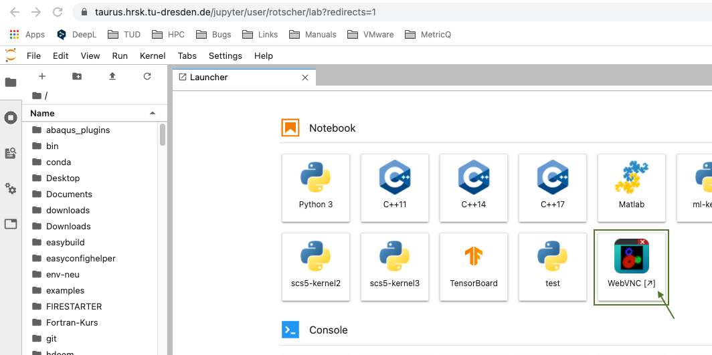

# Graphical Applications with WebVNC

While many of the applications that run on ZIH systems are used from the command line,
graphical user interfaces are sometimes beneficial for particular use cases.
In order to simplify the setup, few solutions are available, which are described in the following.

The solutions provided here are based on a Singularity container with a VNC setup that can be
used as an alternative to SSH's X-Forwarding option to start graphical applications.

Internally, the solution utilizes [noVNC](https://novnc.com) to offer a web-based client that you
can use with your browser, so there's no additional client software necessary.

## Access via JupyterHub

**Check out our new documentation about [Virtual Desktops](../software/virtual_desktops.md).**

To start a JupyterHub session on the partition `interactive` with two CPU
cores and 2583 MB memory per core, click on: [https://taurus.hrsk.tu-dresden.de/jupyter/hub/spawn#/~(partition~'interactive~cpuspertask~'2~mempercpu~'2583~environment~'production)](https://taurus.hrsk.tu-dresden.de/jupyter/hub/spawn#/~(partition~'interactive~cpuspertask~'2~mempercpu~'2583~environment~'production))
Optionally, you can modify many different Slurm parameters.
For this, follow the general [JupyterHub](../access/jupyterhub.md) documentation.

Your browser should load JupyterLab, which looks like this:


{: align="center"}

Click on the `WebVNC` button. A new tab with the noVNC client will be opened.

## Access via terminal

### Step 1

Start the `runVNC` script in our prepared container in an interactive batch job (here with 4 cores
and 2.5 GB of memory per core):

```console
marie@login$ srun --pty --partition=interactive --mem-per-cpu=2500 --cpus-per-task=4 --time=8:00:00 singularity exec /scratch/singularity/xfce.sif runVNC
[...]
```

Of course, you can adjust the batch job parameters to your liking. Note that the default time limit
in partition `interactive` is only 30 minutes, so you should specify a longer one with `--time` (or `-t`).

The script will automatically generate a self-signed SSL certificate and place it in your home
directory under the name `self.pem`. This path can be overridden via the parameter `--cert` to
`runVNC`.

On success, it will give you an URL and a one-time password:

```console
[...]
Note: Certificate file /home/user/self.pem already exists. Skipping generation.  Starting VNC
server...  Server started successfully.  Please browse to: https://172.24.146.46:5901/vnc.html
The one-time password is: 71149997
```

### Step 2

Direct access to the compute nodes is not allowed. Therefore, you have to create a tunnel from your
laptop or workstation to the specific compute node and port as follows.

```bash
marie@local$ ssh -NL <local port>:<compute node>:<remote port> <zih login>@tauruslogin.hrsk.tu-dresden.de
```

e.g.

```console
marie@local$ ssh -NL 5901:172.24.146.46:5901 marie@tauruslogin.hrsk.tu-dresden.de
```

### Step 3

Open your local web-browser and connect to the following URL, replacing `<local port>` with the
local port you specified in the previous step:

```
https://localhost:<local port>/vnc.html
```

e.g.

```
https://localhost:5901/vnc.html
```

Since you are using a self-signed certificate and the node does not have a public DNS name, your
browser will not be able to verify it and you will have to add an exception (via the "Advanced"
button).

### Step 4

On the website, click the `Connect` button and enter the one-time password that was previously
displayed in order to authenticate. You will then see an Xfce4 desktop and can start a terminal in
there, where you can use the "ml" or "module" command as usual to load and then run your graphical
applications. Enjoy!
