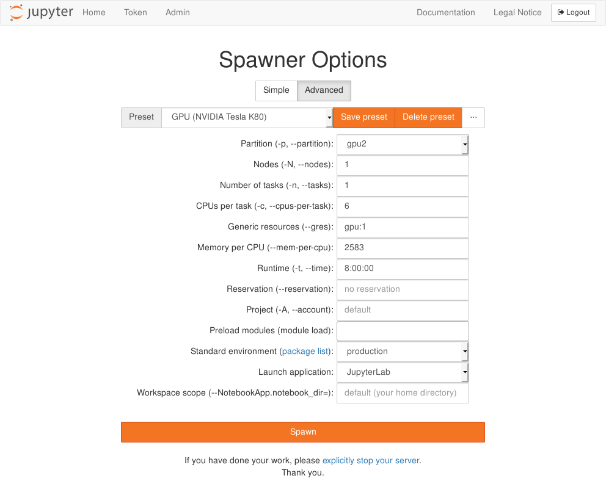
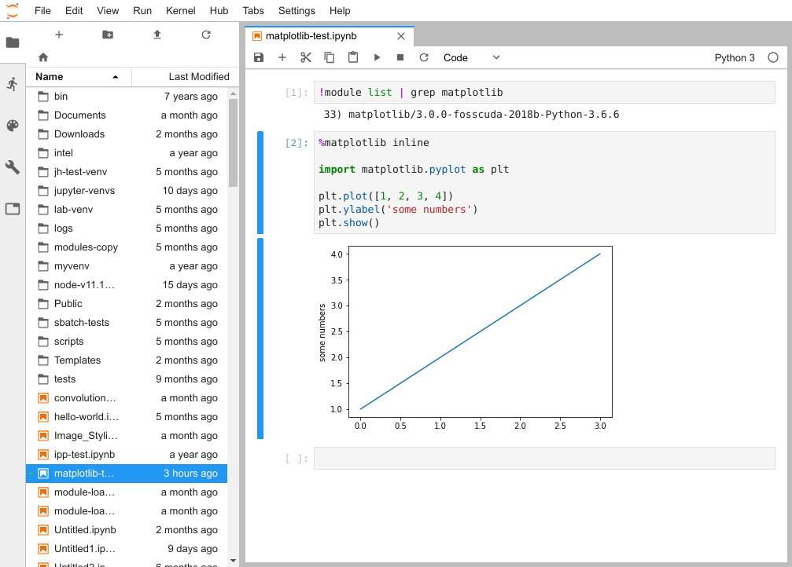
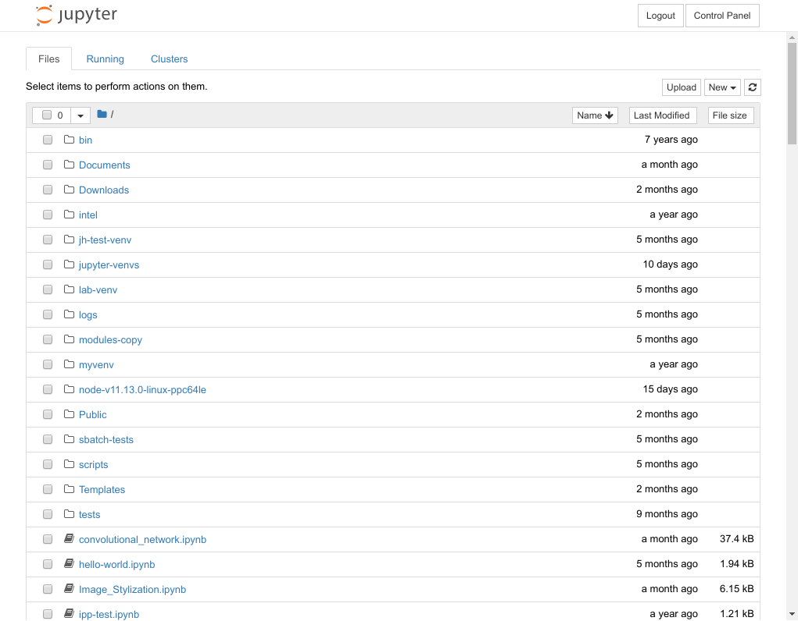
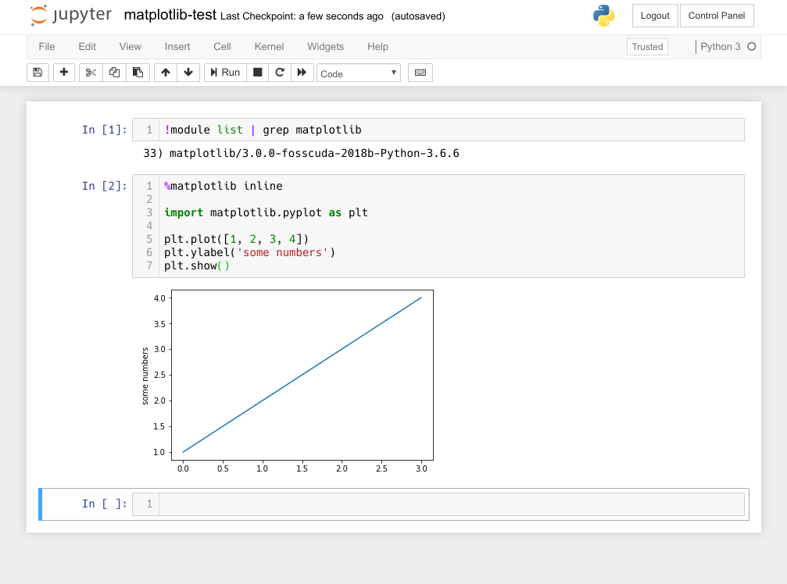
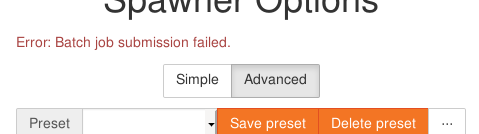
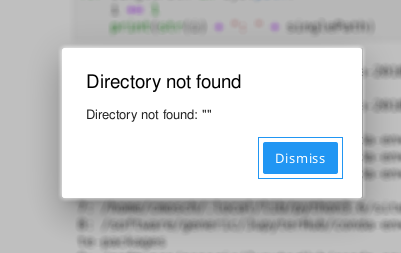
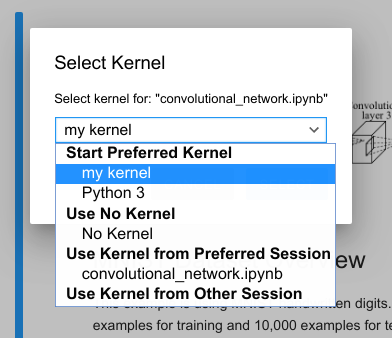
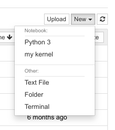
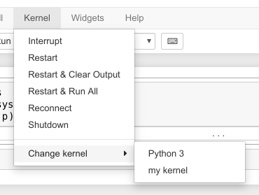

# JupyterHub

With our JupyterHub service we offer you a quick and easy way to work with Jupyter notebooks on ZIH
systems. This page covers starting and stopping JupyterHub sessions, error handling and customizing
the environment.

We also provide a comprehensive documentation on how to use
[JupyterHub for Teaching (git-pull feature, quickstart links, direct links to notebook files)](jupyterhub_for_teaching.md).

## Disclaimer

!!! warning

    The JupyterHub service is provided *as-is*, use at your own discretion.

Please understand that JupyterHub is a complex software system of which we are not the developers
and don't have any downstream support contracts for, so we merely offer an installation of it but
cannot give extensive support in every case.

## Access

!!! note
    This service is only available for users with an active HPC project.
    See [Application for Login and Resources](../application/overview.md), if you need to apply for
    an HPC project.

JupyterHub is available at
[https://taurus.hrsk.tu-dresden.de/jupyter](https://taurus.hrsk.tu-dresden.de/jupyter).

## Start a Session

Start a new session by clicking on the `Start my server` button.

A form opens up where you can customize your session. Our simple form
offers you the most important settings to start quickly.


{: align="center"}

For advanced users we have an extended form where you can change many
settings. You can:

- modify batch system parameters to your needs ([more about batch system Slurm](../jobs_and_resources/slurm.md))
- assign your session to a project or reservation
- load modules from the [module system](../software/modules.md)
- choose a different standard environment (in preparation for future
  software updates or testing additional features)


{: align="center"}

You can save your own configurations as additional presets. Those are
saved in your browser and are lost if you delete your browsing data. Use
the import/export feature (available through the button) to save your
presets in text files.

!!! info
    The partition [alpha](https://doc.zih.tu-dresden.de/hpc-wiki/bin/view/Compendium/AlphaCentauri)
    is available only in the extended form.

## Applications

You can choose between JupyterLab or classic Jupyter notebooks as outlined in the following.

### JupyterLab


{: align="center"}

The main workspace is used for multiple notebooks, consoles or
terminals. Those documents are organized with tabs and a very versatile
split screen feature. On the left side of the screen you can open
several views:

- file manager
- controller for running kernels and terminals
- overview of commands and settings
- details about selected notebook cell
- list of open tabs

### Classic Jupyter Notebook

Initially your `home` directory is listed. You can open existing notebooks or files by navigating to
the corresponding path and clicking on them.


{: align="center"}

Above the table on the right side is the button `New` which lets you create new notebooks, files,
directories or terminals.


{: align="center"}

## Jupyter Notebooks in General

In JupyterHub you can create scripts in notebooks. Notebooks are programs which are split into
multiple logical code blocks.  In between those code blocks you can insert text blocks for
documentation and each block can be executed individually. Each notebook is paired with a kernel
running the code. We currently offer one for Python, C++, MATLAB and R.

## Stop a Session

It is good practice to stop your session once your work is done. This releases resources for other
users and your quota is less charged. If you just log out or close the window, your server continues
running and **will not stop** until the Slurm job runtime hits the limit (usually 8 hours).

At first you have to open the JupyterHub control panel.

**JupyterLab**: Open the file menu and then click on `Logout`. You can
also click on `Hub Control Panel` which opens the control panel in a new
tab instead.


{: align="center"}

**Classic Jupyter notebook**: Click on the control panel button on the top right
of your screen.


{: align="center"}

Now you are back on the JupyterHub page and you can stop your server by clicking on

{: align="center"}

## Error Handling

We want to explain some errors that you might face sooner or later.
If you need help open a ticket at [HPC support](mailto:hpcsupport@zih.tu-dresden.de).

### Error at Session Start


{: align="center"}

This message appears instantly if your batch system parameters are not valid.
Please check those settings against the available hardware.
Useful pages for valid batch system parameters:

- [General information how to use Slurm](../jobs_and_resources/slurm.md)
- [Partitions and limits](../jobs_and_resources/partitions_and_limits.md)

### Error Message in JupyterLab


{: align="center"}

If the connection to your notebook server unexpectedly breaks, you will get this error message.
Sometimes your notebook server might hit a batch system or hardware limit and gets killed. Then
usually the log file of the corresponding batch job might contain useful information. These log
files are located in your `home` directory and have the name `jupyter-session-<jobid>.log`.

## Advanced Tips

### Standard Environments

The default Python kernel uses conda environments based on the
[Watson Machine Learning Community Edition (formerly PowerAI)](https://developer.ibm.com/linuxonpower/deep-learning-powerai/)
package suite. You can open a list with all included packages of the
exact standard environment through the spawner form:


{: align="center"}

This list shows all packages of the currently selected conda environment. This depends on your
settings for partition (CPU architecture) and standard environment.

There are three standard environments:

- production
- test
- python-env-python3.8.6

**Python-env-python3.8.6** virtual environment can be used for all x86 partitions(`gpu2`, `alpha`,
etc). It gives the opportunity to create a user kernel with the help of a Python environment.

Here is a short list of some included software:

|            | generic\* | ml     |
|------------|-----------|--------|
| Python     | 3.6.10    | 3.6.10 |
| R\*\*      | 3.6.2     | 3.6.0  |
| WML CE     | 1.7.0     | 1.7.0  |
| PyTorch    | 1.3.1     | 1.3.1  |
| TensorFlow | 2.1.1     | 2.1.1  |
| Keras      | 2.3.1     | 2.3.1  |
| numpy      | 1.17.5    | 1.17.4 |
| matplotlib | 3.3.1     | 3.0.3  |

\* generic = all partitions except ml

\*\* R is loaded from the [module system](../software/modules.md)

### Creating and Using a Custom Environment

!!! info

    Interactive code interpreters which are used by Jupyter notebooks are called *kernels*. Creating
    and using your own kernel has the benefit that you can install your own preferred Python
    packages and use them in your notebooks.

We currently have two different architectures at ZIH systems.
Build your kernel environment on the **same architecture** that you want to use
later on with the kernel. In the examples below we use the name
"my-kernel" for our user kernel. We recommend to prefix your kernels
with keywords like `haswell`, `ml`, `romeo`, `venv`, `conda`. This way you
can later recognize easier how you built the kernel and on which hardware it will work.

**Intel nodes** (e.g. partition `haswell`, `gpu2`):

```console
maria@login$ srun --pty --ntasks=1 --cpus-per-task=2 --mem-per-cpu=2541 --time=08:00:00 bash -l
```

**Power nodes** (partition `ml`):

```console
maria@login$ srun --pty --partition=ml --ntasks=1 --cpus-per-task=2 --mem-per-cpu=1443 --time=08:00:00 bash -l
```

Create a virtual environment in your `home` directory. You can decide between Python virtualenvs or
conda environments.

!!! note
    Please take in mind that Python venv is the preferred way to create a Python virtual environment.

#### Python Virtualenv

```console
marie@compute$ module load Python/3.8.6-GCCcore-10.2.0
marie@compute$ mkdir user-kernel # please use workspaces!
marie@compute$ cd user-kernel
marie@compute$ virtualenv --system-site-packages my-kernel
Using base prefix '/sw/installed/Python/3.6.6-fosscuda-2018b'
New python executable in .../user-kernel/my-kernel/bin/python
Installing setuptools, pip, wheel...done.
marie@compute$ source my-kernel/bin/activate
marie@compute$ pip install ipykernel
Collecting ipykernel
[...]
Successfully installed ... ipykernel-5.1.0 ipython-7.5.0 ...
marie@compute$ pip install --upgrade pip
marie@compute$ python -m ipykernel install --user --name my-kernel --display-name="my kernel"
Installed kernelspec my-kernel in .../.local/share/jupyter/kernels/my-kernel
marie@compute$ pip install [...] # now install additional packages for your notebooks
marie@compute$ deactivate
```

#### Conda Environment

Load the needed module for Intel nodes

```console
marie@compute$ module load Anaconda3
```

... or for IBM nodes (partition `ml`):

```console
marie@ml$ module load PythonAnaconda
```

Continue with environment creation, package installation and kernel registration:

```console
marie@compute$ mkdir user-kernel # please use workspaces!
marie@compute$ conda create --prefix /home/<USER>/user-kernel/my-kernel python=3.6
Collecting package metadata: done
Solving environment: done
[...]
marie@compute$ conda activate /home/<USER>/user-kernel/my-kernel
marie@compute$ conda install ipykernel
Collecting package metadata: done
Solving environment: done
[...]
marie@compute$ python -m ipykernel install --user --name my-kernel --display-name="my kernel"
Installed kernelspec my-kernel in [...]
marie@compute$ conda install [..] # now install additional packages for your notebooks
marie@compute$ conda deactivate
```

Now you can start a new session and your kernel should be available.

**JupyterLab**: Your kernels are listed on the launcher page:


{: align="center"}

You can switch kernels of existing notebooks in the menu:


{: align="center"}

**Classic Jupyter notebook**: Your kernel is listed in the New menu:


{: align="center"}

You can switch kernels of existing notebooks in the kernel menu:


{: align="center"}

!!! note
    Both python venv and conda virtual environments will be mention in the same list.

### Loading Modules

You have now the option to preload modules from the [module system](../software/modules.md).
Select multiple modules that will be preloaded before your notebook server starts. The list of
available modules depends on the module environment you want to start the session in (`scs5` or
`ml`). The right module environment will be chosen by your selected partition.
