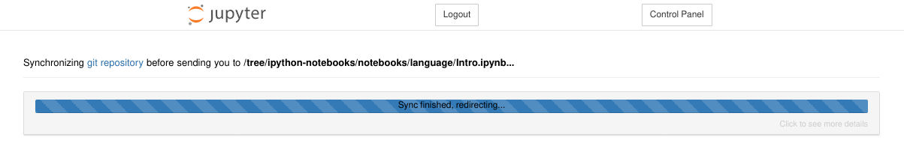
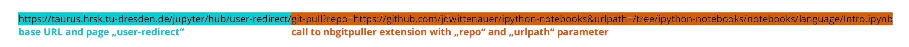

# JupyterHub for Teaching

On this page, we want to introduce to you some useful features if you want to use JupyterHub for
teaching.

!!! note

    JupyterHub uses compute resources from ZIH systems.

Please be aware of the following notes:

- ZIH systems operate at a lower availability level than your usual Enterprise Cloud VM. There can
  always be downtimes, e.g. of the filesystems or the batch system.
- Scheduled downtimes are announced by email. Please plan your courses accordingly.
- Access to HPC resources is handled through projects. See your course as a project. Projects need
  to be registered beforehand (more info on the page [Access](../application/overview.md)).
- Don't forget to [add your users](../application/project_management.md#manage-project-members-dis-enable)
  (e.g. students or tutors) to your project.
- It might be a good idea to [request a reservation](../jobs_and_resources/overview.md#exclusive-reservation-of-hardware)
  of part of the compute resources for your project/course to avoid unnecessary waiting times in
  the batch system queue.

## Clone a Repository With a Link

This feature bases on [nbgitpuller](https://github.com/jupyterhub/nbgitpuller). Further information
can be found in the [external documentation about nbgitpuller](https://jupyterhub.github.io/nbgitpuller/).

This extension for Jupyter notebooks can clone every public git repository into the users work
directory. It's offering a quick way to distribute notebooks and other material to your students.


{: align="center"}

A shareable link for this feature looks like this:

<https://taurus.hrsk.tu-dresden.de/jupyter/hub/user-redirect/git-pull?repo=https://github.com/jdwittenauer/ipython-notebooks&urlpath=/tree/ipython-notebooks/notebooks/language/Intro.ipynb>


{: align="center"}

This example would clone the repository
[https://github.com/jdwittenauer/ipython-notebooks](https://github.com/jdwittenauer/ipython-notebooks)
and afterwards open the **Intro.ipynb** notebook in the given path.

The following parameters are available:

| Parameter | Info |
|---|---|
|`repo`    | path to git repository|
|`branch`  | branch in the repository to pull from default: `master`|
|`urlpath` | URL to redirect the user to a certain file, [more info about parameter urlpath](https://jupyterhub.github.io/nbgitpuller/topic/url-options.html#urlpath)|
|`depth`   | clone only a certain amount of latest commits not recommended|

This [link
generator](https://jupyterhub.github.io/nbgitpuller/link?hub=https://taurus.hrsk.tu-dresden.de/jupyter/)
might help creating those links

## Spawn Options Pass-through with URL Parameters

The spawn form now offers a quick start mode by passing URL parameters.

!!! example

    The following link would create a jupyter notebook session on the `interactive` partition with the `test`
    environment being loaded:

    ```
    https://taurus.hrsk.tu-dresden.de/jupyter/hub/spawn#/~(partition~'interactive~environment~'test)
    ```


{: align="center"}

Every parameter of the advanced form can be set with this parameter. If the parameter is not
mentioned, the default value will be loaded.

| Parameter       | Default Value                            |
|:----------------|:-----------------------------------------|
| `partition`       | default                                  |
| `nodes`           | 1                                        |
| `ntasks`          | 1                                        |
| `cpuspertask`     | 1                                        |
| `gres`            | *empty* (no generic resources)           |
| `mempercpu`       | 1000                                     |
| `runtime`         | 8:00:00                                  |
| `reservation`     | *empty* (use no reservation)             |
| `project`         | *empty* (use default project)            |
| `modules`         | *empty* (do not load additional modules) |
| `environment`     | production                               |
| `launch`          | JupyterLab                               |
| `workspace_scope` | *empty* (home directory)                 |

You can use the advanced form to generate a URL for the settings you want. The address bar contains
the encoded parameters starting with `#/`.

### Combination of Quickstart and Git-Pull Feature

You can combine both features in a single link:

```
https://taurus.hrsk.tu-dresden.de/jupyter/hub/user-redirect/git-pull?repo=https://github.com/jdwittenauer/ipython-notebooks&urlpath=/tree/ipython-notebooks/notebooks/language/Intro.ipynb#/~(partition~'interactive~environment~'test)
```


{: align="center"}

## Open a Notebook Automatically with a Single Link

With the following link you will be redirected to a certain file in your
home directory.

[https://taurus.hrsk.tu-dresden.de/jupyter/user-redirect/notebooks/demo.ipynb]
(https://taurus.hrsk.tu-dresden.de/jupyter/user-redirect/notebooks/demo.ipynb)

The file needs to exist, otherwise a 404 error will be thrown.


{: align="center"}

This link would redirect to
`https://taurus.hrsk.tu-dresden.de/jupyter/user/{login}/notebooks/demo.ipynb`.
