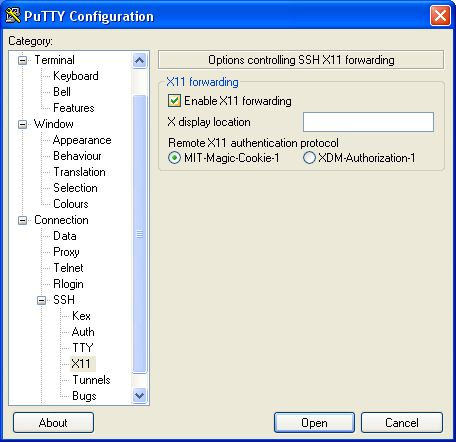
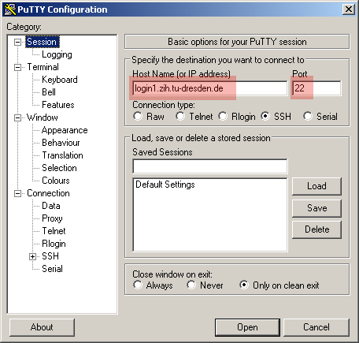

# Prerequisites for Access to a Linux Cluster From a Windows Workstation

To work at an HPC system at ZIH you need

- a program that provides you a command shell (like
  [PuTTY](http://www.chiark.greenend.org.uk/%7Esgtatham/putty/download.html)
  or
  [Secure Shell ssh3.2](http://tu-dresden.de/die_tu_dresden/zentrale_einrichtungen/zih/dienste/datennetz_dienste/secure_shell/);
  both free) (The putty.exe is only to download at the desktop. (No installation))

and if you would like to use graphical software from the HPC system

- an X-Server (like [X-Ming](http://www.straightrunning.com/XmingNotes/)
  or [CygWin32](http://www.cygwin.com/cygwin/)

at your local PC. Here, you can find installation descriptions for the X servers:
[X-Ming Installation](misc/install-Xming.pdf)

[CygWin Installation](misc/cygwin_doku_de.pdf)

Please note: You have also to install additional fonts for X-Ming at your PC. (also to find at
[this website](http://www.straightrunning.com/XmingNotes/).  If you would like transfer files
between your PC and an HPC machine, you should also have

- [WinSCP](http://winscp.net/eng/docs/lang:de>) (an SCP program is also included in the
  "Secure Shell ssh3.2" software; see above)

installed at your PC.

We advice putty + Xming (+ WinSCP).

Please note: If you use software with OpenGL (like abaqus), please install "Xming-mesa" instead of
"Xmin".

After installation you have to start always at first the X-server. At the bottom right corner you
will get an new icon (a black X for X-Ming).  Now you can start putty.exe. A window will appear
where you have to give the name of the computer and you have to switch ON the "X11 forwarding".
(please look at the figures)

{: align="center"}

{: align="center"}

<!--\
<!--name of HPC-machine" width="300" /> \
<!--src="%PUBURL%/Compendium/Login/putty2.jpg" title="putty: switch on X11"-->
<!--width="300" /> \ -->

Now you can *Open* the connection. You will get a window from the remote machine, where you can put
your Linux commands. If you would like to use commercial software, please follow the next
instructions about the modules.

## Copy Files from the HRSK Machines to Your Local Machine

Take the following steps if your Workstation has a Windows operating system. You need putty (see
above) and your favorite SCP program, in this example WinSCP.

* Make a connection to `login1.zih.tu-dresden.de`

{: align="center"}

* Setup SSH tunnel (data from your machine port 1222 will be directed to deimos port 22)

{: align="center"}

* After clicking on the "Add" button, the tunnel should look like that

{: align="center"}

- Click "Open" and enter your login and password (upon successful login, the tunnel will exist)

{: align="center"}

- Put the putty window in the background (leave it running) and open  WinSCP (or your favorite SCP
  program), connect to localhost:1222

{: align="center"}

- After hitting "Login" and entering your username/password, you can
  access your files on deimos.
