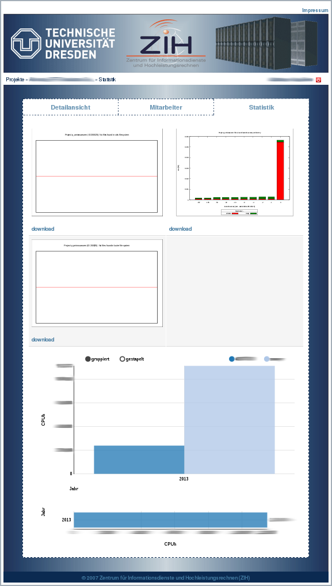

# Project Management

The HPC project leader has overall responsibility for the project and for all activities within the
corresponding project on ZIH systems. In particular the project leader shall:

* add and remove users from the project,
* update contact details of the project members,
* monitor the resources of the project,
* inspect and store data of retiring users.

The project leader can appoint a *project administrator* with an HPC account to manage these
technical details.

The front-end to the HPC project database enables the project leader and the project administrator
to

* add and remove users from the project,
* define a technical administrator,
* view statistics (resource consumption),
* file a new HPC proposal,
* file results of the HPC project.

## Access

{loading=lazy width=300 style="float:right"}
[Entry point to the project management system](https://hpcprojekte.zih.tu-dresden.de/managers)
The project leaders of an ongoing project and their accredited admins
are allowed to login to the system. In general each of these persons
should possess a ZIH login at the Technical University of Dresden, with
which it is possible to log on the homepage. In some cases, it may
happen that a project leader of a foreign organization do not have a ZIH
login. For this purpose, it is possible to set a local password:
"[Missing Password](https://hpcprojekte.zih.tu-dresden.de/managers/members/missingPassword)".

&nbsp;
{: style="clear:right;"}

{loading=lazy width=300 style="float:right"}
On the 'Missing Password' page, it is possible to reset the passwords of a 'non-ZIH-login'. For this
you write your login, which usually corresponds to your email address, in the field and click on
'reset. Within 10 minutes the system sends a signed e-mail from <hpcprojekte@zih.tu-dresden.de> to
the registered e-mail address. this e-mail contains a link to reset the password.

&nbsp;
{: style="clear:right;"}

## Projects

{loading=lazy width=300 style="float:right"}
After login you reach an overview that displays all available projects. In each of these projects
are listed, you are either project leader or an assigned project administrator. From this list, you
have the option to view the details of a project or make a following project request. The latter is
only possible if a project has been approved and is active or was. In the upper right area you will
find a red button to log out from the system.

&nbsp;
{: style="clear:right;"}

{loading=lazy width=300 style="float:right"}
The project details provide information about the requested and allocated resources. The other tabs
show the employee and the statistics about the project.

&nbsp;
{: style="clear:right;"}

### Manage Project Members (dis-/enable)

{loading=lazy width=300 style="float:right"}
The project members can be managed under the tab 'employee' in the project details. This page gives
an overview of all ZIH logins that are a member of a project and its status. If a project member
marked in green, it can work on all authorized HPC machines when the project has been approved. If
an employee is marked in red, this can have several causes:

* the employee was manually disabled by project managers, project administrator
  or ZIH staff
* the employee was disabled by the system because its ZIH login expired
* confirmation of the current HPC-terms is missing

You can specify a user as an administrator. This user can then access the project management system.
Next, you can disable individual project members. This disabling is only a "request of disabling"
and has a time delay of 5 minutes. An user can add or reactivate itself, with its ZIH-login, to a
project via the link on the end of the page. To prevent misuse this link is valid for 2 weeks and
will then be renewed automatically.

&nbsp;
{: style="clear:right;"}

{loading=lazy width=300 style="float:right"}
The link leads to a page where you can sign in to a project by accepting the term of use. You need
also an valid ZIH-Login. After this step it can take 1-1,5 h to transfer the login to all cluster
nodes.

&nbsp;
{: style="clear:right;"}

### Statistic

{loading=lazy width=300 style="float:right"}
The statistic is located under the tab 'Statistic' in the project details. The data will updated
once a day an shows used CPU-time and used disk space of an project. Following projects shows also
the data of the predecessor.

&nbsp;
{: style="clear:right;"}
