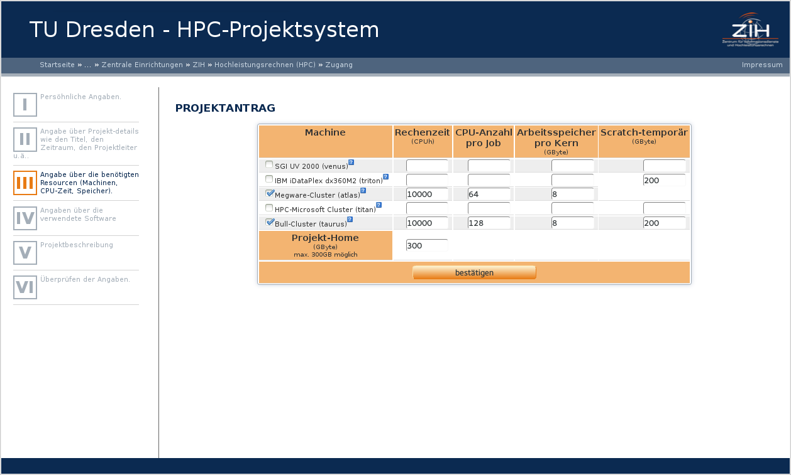
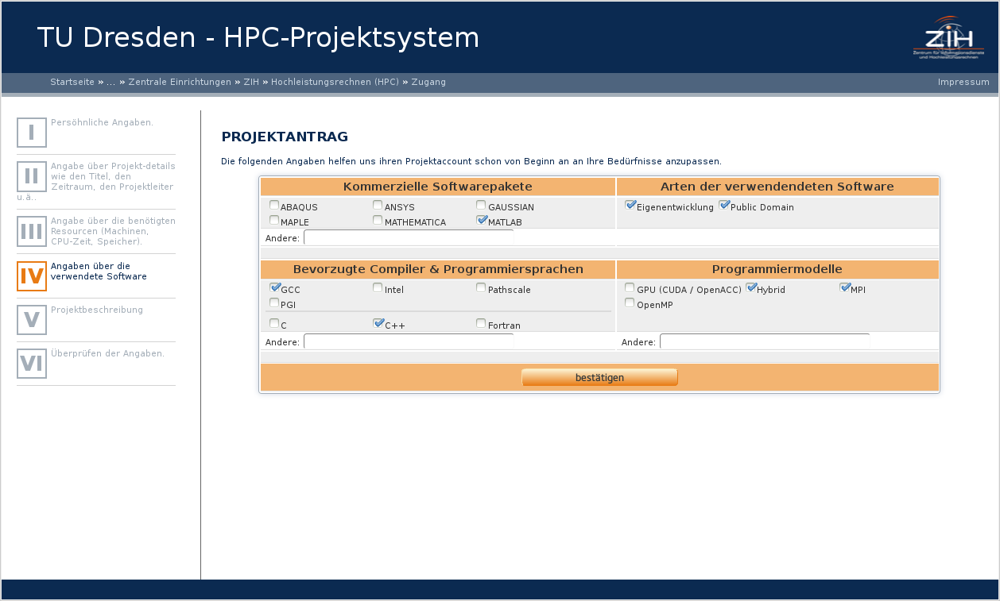
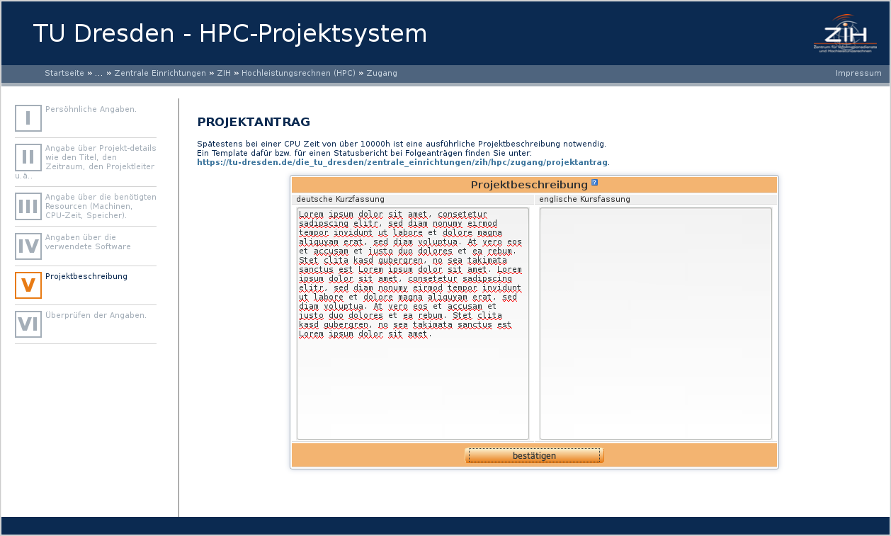

# Project Request Form

## First Step: Requester

{loading=lazy width=170 style="float:right"}
The first step is asking for the personal information of the requester.
**That's you**, not the leader of this project! If you have an
ZIH-Login, you can use it [Pic 1]. If not, you have to
fill in the whole information [Pic.:2].

## Second Step: Project Details

{loading=lazy width=170 style="float:right"}
This Step is asking for general project Details.

Any project have:

-   a title, at least 20 characters long
-   a valid duration
    -   Projects starts at the first of a month and ends on the last day
        of a month. So you are not able to send on the second of a month
        a project request which start in this month.
    -   The approval is for a maximum of one year. Be careful: a
        duration from "May, 2013" till "May 2014" has 13 month.
-   a selected science, according to the DFG:
    <http://www.dfg.de/dfg_profil/gremien/fachkollegien/faecher/index.jsp>
-   a sponsorship
-   a kind of request
-   a project leader/manager
    -   The leader of this project should hold a professorship
        (university) or is the head of the research group.
    -   If you are this Person, leave this fields free.

## Third step: Hardware

{loading=lazy width=170 style="float:right"}
This step inquire the required hardware. You can find the specifications [here]**todo fix link**

For your guidance:

-   gpu => taurus
-   many main memory => venus
-   other machines => you know it and don't need this guidance

## Fourth Step: Software

{loading=lazy width=170 style="float:right"}
Any information you will give us in this step, helps us to make a rough estimate, if you are able
to realize your project. For Example: you need matlab. Matlab is only
available on Taurus.

## Fifth Step: Project Description

{loading=lazy width=170 style="float:right"}

## Sixth Step: Summary

{loading=lazy width=170 style="float:right"}
