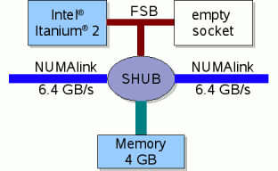
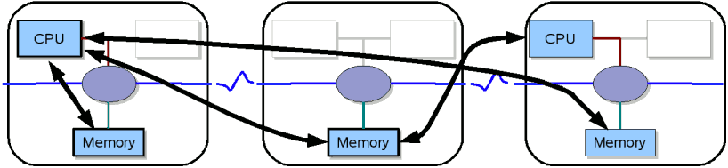

# SGI Altix

!!! warning

    **This page is deprecated! The SGI Altix is a former system!**

## System

The SGI Altix 4700 is a shared memory system with dual core Intel Itanium 2 CPUs (Montecito)
operated by the Linux operating system SUSE SLES 10 with a 2.6 kernel. Currently, the following
Altix partitions are installed at ZIH:

|Name|Total Cores|Compute Cores|Memory per Core|
|:----|:----|:----|:----|
| Mars |384 |348 |1 GB|
|Jupiter |512 |506 |4 GB|
|Saturn |512 |506 |4 GB|
|Uranus |512 |506|4 GB|
|Neptun |128 |128 |1 GB|

The jobs for these partitions (except Neptun) are scheduled by the [Platform LSF](platform_lsf.md)
batch system running on `mars.hrsk.tu-dresden.de`. The actual placement of a submitted job may
depend on factors like memory size, number of processors, time limit.

### Filesystems

All partitions share the same CXFS filesystems `/work` and `/fastfs`.

### ccNUMA Architecture

The SGI Altix has a ccNUMA architecture, which stands for *Cache Coherent Non-Uniform Memory Access*.
It can be considered as a SM-MIMD (*shared memory - multiple instruction multiple data*) machine.
The SGI ccNUMA system has the following properties:

- Memory is physically distributed but logically shared
- Memory is kept coherent automatically by hardware.
- Coherent memory: memory is always valid (caches hold copies)
- Granularity is L3 cache line (128 B)
- Bandwidth of NUMAlink4 is 6.4 GB/s

The ccNUMA is a compromise between a distributed memory system and a flat symmetric multi processing
machine (SMP). Although the memory is shared, the access properties are not the same.

### Compute Module

The basic compute module of an Altix system is shown below.


{: align="center"}

It consists of one dual core Intel Itanium 2 "Montecito" processor, the
local memory of 4 GB (2 GB on `Mars`), and the communication component,
the so-called SHUB. All resources are shared by both cores. They have a
common front side bus, so that accumulated memory bandwidth for both is
not higher than for just one core.

The SHUB connects local and remote resources. Via the SHUB and NUMAlink
all CPUs can access remote memory in the whole system. Naturally, the
fastest access provides local memory. There are some hints and commands
that may help you to get optimal memory allocation and process placement
). Four of these blades are grouped together with a NUMA router in a
compute brick. All bricks are connected with NUMAlink4 in a
"fat-tree"-topology.

Remote memory access via SHUBs and NUMAlink

{: align="center"}

### CPU

The current SGI Altix is based on the dual core Intel Itanium 2
processor (code name "Montecito"). One core has the following basic
properties:

|                                     |                            |
|-------------------------------------|----------------------------|
| clock rate                          | 1.6 GHz                    |
| integer units                       | 6                          |
| floating point units (multiply-add) | 2                          |
| peak performance                    | 6.4 GFLOPS                 |
| L1 cache                            | 2 x 16 kB, 1 clock latency |
| L2 cache                            | 256 kB, 5 clock latency    |
| L3 cache                            | 9 MB, 12 clock latency     |
| front side bus                      | 128 bit x 200 MHz          |

The theoretical peak performance of all Altix partitions is hence about 13.1 TFLOPS.

The processor has hardware support for efficient software pipelining. For many scientific
applications it provides a high sustained performance exceeding the performance of RISC CPUs with
similar peak performance. On the down side is the fact that the compiler has to explicitly discover
and exploit the parallelism in the application.

## Usage

### Compiling Parallel Applications

This installation of the Message Passing Interface supports the MPI 1.2 standard with a few MPI-2
features (see `man mpi` ). There is no command like `mpicc`, instead you just have to use the normal
compiler (e.g.  `icc`, `icpc`, or `ifort`) and append `-lmpi` to the linker command line. Since the
include files as well as the library are in standard directories there is no need to append
additional library- or include-paths.

- Note for C++ programmers: You need to link with `-lmpi++abi1002 -lmpi` instead of `-lmpi`.
- Note for Fortran programmers: The MPI module is only provided for the Intel compiler and does not
  work with `gfortran`.

Please follow these following guidelines to run your parallel program using the batch system on
Mars.

### Batch System

Applications on an HPC system can not be run on the login node. They have to be submitted to compute
nodes with dedicated resources for the user's job. Normally a job can be submitted with these data:

- number of CPU cores,
- requested CPU cores have to belong on one node (OpenMP programs) or
  can distributed (MPI),
- memory per process,
- maximum wall clock time (after reaching this limit the process is
  killed automatically),
- files for redirection of output and error messages,
- executable and command line parameters.

#### LSF

The batch system on Atlas is LSF, see also the
[general information on LSF](platform_lsf.md).

#### Submission of Parallel Jobs

The MPI library running on the Altix is provided by SGI and highly optimized for the ccNUMA
architecture of this machine. However, communication within a partition is faster than across
partitions. Take this into consideration when you submit your job.

Single-partition jobs can be started like this:

```console
bsub -R "span[hosts=1]" -n 16 mpirun -np 16 a.out<
```

Really large jobs with over 256 CPUs might run over multiple partitions. Cross-partition jobs can
be submitted via PAM like this

```console
bsub -n 1024 pamrun a.out
```

#### Batch Queues

| Batch Queue    | Admitted Users   | Available CPUs      | Default Runtime | Max. Runtime |
|:---------------|:-----------------|:--------------------|:----------------|:-------------|
| `interactive`  | `all`            | `min. 1, max. 32`   | `12h`           | `12h`        |
| `small`        | `all`            | `min. 1, max. 63`   | `12h`           | `120h`       |
| `intermediate` | `all`            | `min. 64, max. 255` | `12h`           | `120h`       |
| `large`        | `all`            | `min.256, max.1866` | `12h`           | `24h`        |
| `ilr`          | `selected users` | `min. 1, max. 768`  | `12h`           | `24h`        |
