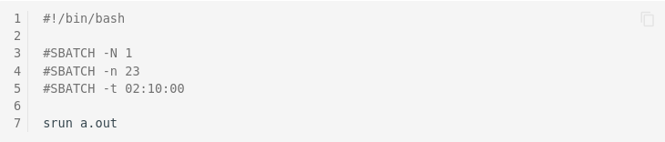
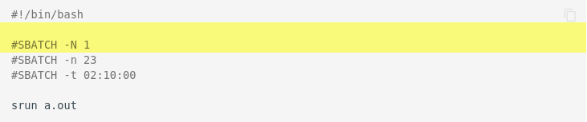

# Content Rules

**Remark:** Avoid using tabs both in markdown files and in `mkdocs.yaml`. Type spaces instead.

## New Page and Pages Structure

The pages structure is defined in the configuration file `mkdocs.yaml`:

```Bash
docs/
  - Home: index.md
  - Application for HPC Login: application.md
  - Request for Resources: req_resources.md
  - Access to the Cluster: access.md
  - Available Software and Usage:
    - Overview: software/overview.md
  [...]
```

To add a new page to the documentation follow these two steps:

1. Create a new markdown file under `docs/subdir/file_name.md` and put the documentation inside.
The sub-directory and file name should follow the pattern `fancy_title_and_more.md`.
1. Add `subdir/file_name.md` to the configuration file `mkdocs.yml` by updating the navigation
   section.

Make sure that the new page **is not floating**, i.e., it can be reached directly from
the documentation structure.

## Markdown

1. Please keep things simple, i.e., avoid using fancy markdown dialects.
    * [Cheat Sheet](https://github.com/adam-p/markdown-here/wiki/Markdown-Cheatsheet)
    * [Style Guide](https://github.com/google/styleguide/blob/gh-pages/docguide/style.md)

1. Do not add large binary files or high resolution images to the repository. See this valuable
   document for [image optimization](https://web.dev/fast/#optimize-your-images).

1. [Admonitions](https://squidfunk.github.io/mkdocs-material/reference/admonitions/) may be
actively used, especially for longer code examples, warnings, tips, important information that
should be highlighted, etc. Code examples, longer than half screen height should collapsed
(and indented):

??? example
    ```Bash
    [...]
    # very long example here
    [...]
    ```

## Writing Style

* Capitalize headings, e.g. *Exclusive Reservation of Hardware*
* Give keywords in link texts, e.g. [Code Blocks](#code-blocks-and-syntax-highlighting) is more
  descriptive than [this subsection](#code-blocks-and-syntax-highlighting)
* Use active over passive voice
    * Write with confidence. This confidence should be reflected in the documentation, so that
      the readers trust and follow it.
    * Example: `We recommend something` instead of `Something is recommended.`

## Spelling and Technical Wording

To provide a consistent and high quality documentation, and help users to find the right pages,
there is a list of conventions w.r.t. spelling and technical wording.

* Language settings: en_us
* `I/O` not `IO`
* `Slurm` not `SLURM`
* `Filesystem` not `file system`
* `ZIH system` and `ZIH systems` not `Taurus`, `HRSKII`, `our HPC systems`, etc.
* `Workspace` not `work space`
* avoid term `HPC-DA`
* Partition names after the keyword *partition*: *partition `ml`* not *ML partition*, *ml
  partition*, *`ml` partition*, *"ml" partition*, etc.

### Long Options

* Use long over short options, e.g. `srun --nodes=2 --ntasks-per-node=4 ...` is preferred over
  `srun -N 2 -n 4 ...`
* Use `module` over the short front-end `ml` in documentation and examples

## Code Blocks and Command Prompts

Showing commands and sample output is an important part of all technical documentation. To make
things as clear for readers as possible and provide a consistent documentation, some rules have to
be followed.

1. Use ticks to mark code blocks and commands, not italic font.
1. Specify language for code blocks ([see below](#code-blocks-and-syntax-highlighting)).
1. All code blocks and commands should be runnable from a login node or a node within a specific
   partition (e.g., `ml`).
1. It should be clear from the prompt, where the command is run (e.g. local machine, login node or
   specific partition).

### Prompts

We follow this rules regarding prompts:

| Host/Partition         | Prompt           |
|------------------------|------------------|
| Login nodes            | `marie@login$`   |
| Arbitrary compute node | `marie@compute$` |
| `haswell` partition    | `marie@haswell$` |
| `ml` partition         | `marie@ml$`      |
| `alpha` partition      | `marie@alpha$`   |
| `romeo` partition      | `marie@romeo$`   |
| `julia` partition      | `marie@julia$`   |
| Localhost              | `marie@local$`   |

*Remarks:*

* **Always use a prompt**, even there is no output provided for the shown command.
* All code blocks should use long parameter names (e.g. Slurm parameters), if available.
* All code blocks which specify some general command templates, e.g. containing `<` and `>`
  (see [Placeholders](#mark-placeholders)), should use `bash` for the code block. Additionally,
  an example invocation, perhaps with output, should be given with the normal `console` code block.
  See also [Code Block description below](#code-blocks-and-syntax-highlighting).
* Using some magic, the prompt as well as the output is identified and will not be copied!
* Stick to the [generic user name](#data-privacy-and-generic-user-name) `marie`.

### Code Blocks and Syntax Highlighting

This project makes use of the extension
[pymdownx.highlight](https://squidfunk.github.io/mkdocs-material/reference/code-blocks/) for syntax
highlighting.  There is a complete list of supported
[language short codes](https://pygments.org/docs/lexers/).

For consistency, use the following short codes within this project:

With the exception of command templates, use `console` for shell session and console:

````markdown
```console
marie@login$ ls
foo
bar
```
````

Make sure that shell session and console code blocks are executable on the login nodes of HPC system.

Command templates use [Placeholders](#mark-placeholders) to mark replaceable code parts. Command
templates should give a general idea of invocation and thus, do not contain any output. Use a
`bash` code block followed by an invocation example (with `console`):

````markdown
```bash
marie@local$ ssh -NL <local port>:<compute node>:<remote port> <zih login>@tauruslogin.hrsk.tu-dresden.de
```

```console
marie@local$ ssh -NL 5901:172.24.146.46:5901 marie@tauruslogin.hrsk.tu-dresden.de
```
````

Also use `bash` for shell scripts such as job files:

````markdown
```bash
#!/bin/bash
#SBATCH --nodes=1
#SBATCH --time=01:00:00
#SBATCH --output=slurm-%j.out

module load foss

srun a.out
```
````

!!! important

    Use long parameter names where possible to ease understanding.

`python` for Python source code:

````markdown
```python
from time import gmtime, strftime
print(strftime("%Y-%m-%d %H:%M:%S", gmtime()))
```
````

`pycon` for Python console:

````markdown
```pycon
>>> from time import gmtime, strftime
>>> print(strftime("%Y-%m-%d %H:%M:%S", gmtime()))
2021-08-03 07:20:33
```
````

Line numbers can be added via

````markdown
```bash linenums="1"
#!/bin/bash

#SBATCH -N 1
#SBATCH -n 23
#SBATCH -t 02:10:00

srun a.out
```
````

_Result_:



Specific Lines can be highlighted by using

```` markdown
```bash hl_lines="2 3"
#!/bin/bash

#SBATCH -N 1
#SBATCH -n 23
#SBATCH -t 02:10:00

srun a.out
```
````

_Result_:



### Data Privacy and Generic User Name

Where possible, replace login, project name and other private data with clearly arbitrary placeholders.
E.g., use the generic login `marie` and the corresponding project name `p_marie`.

```console
marie@login$ ls -l
drwxr-xr-x   3 marie p_marie      4096 Jan 24  2020 code
drwxr-xr-x   3 marie p_marie      4096 Feb 12  2020 data
-rw-rw----   1 marie p_marie      4096 Jan 24  2020 readme.md
```

## Mark Omissions

If showing only a snippet of a long output, omissions are marked with `[...]`.

## Unix Rules

Stick to the Unix rules on optional and required arguments, and selection of item sets:

* `<required argument or value>`
* `[optional argument or value]`
* `{choice1|choice2|choice3}`

## Graphics and Attachments

All graphics and attachments are saved within `misc` directory of the respective sub directory in
`docs`.

The syntax to insert a graphic or attachment into a page is

```Bash

{: align="center"}
```

The attribute `align` is optional. By default, graphics are left aligned. **Note:** It is crucial to
have `{: align="center"}` on a new line.
