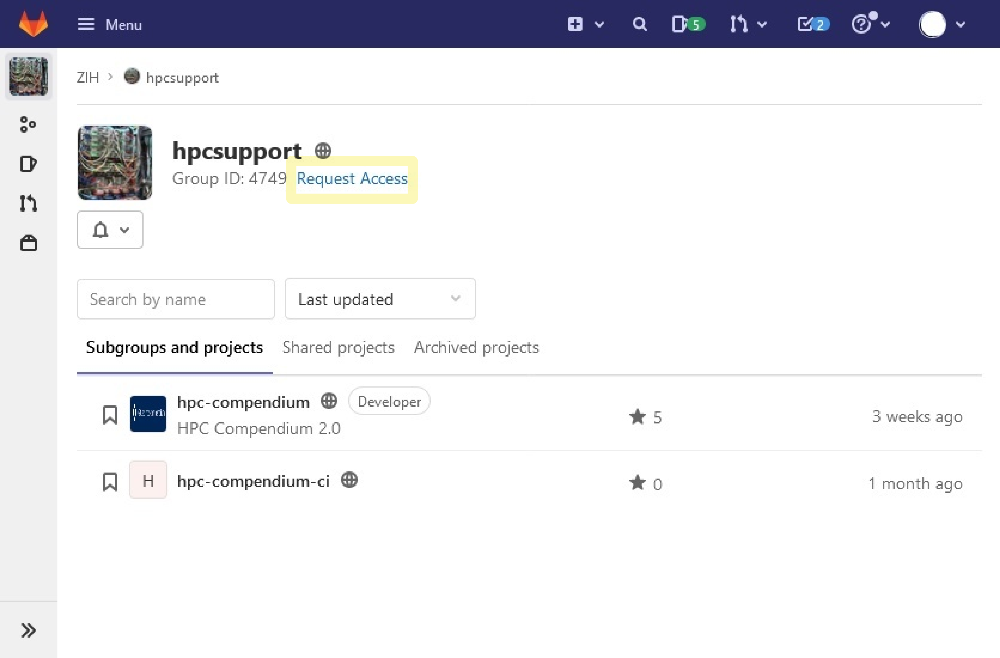
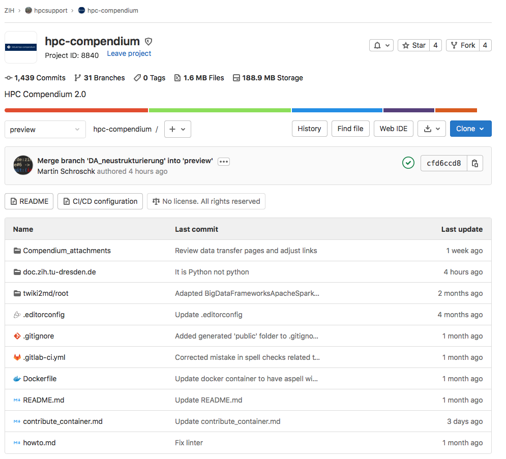
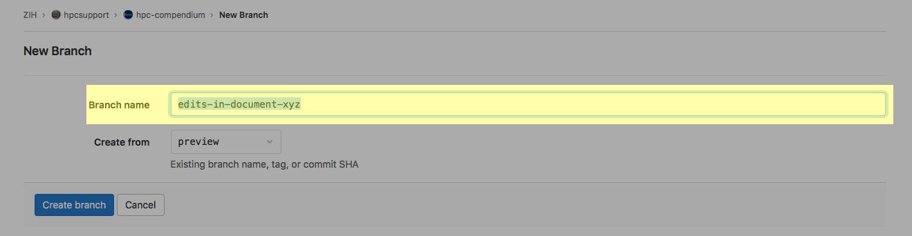
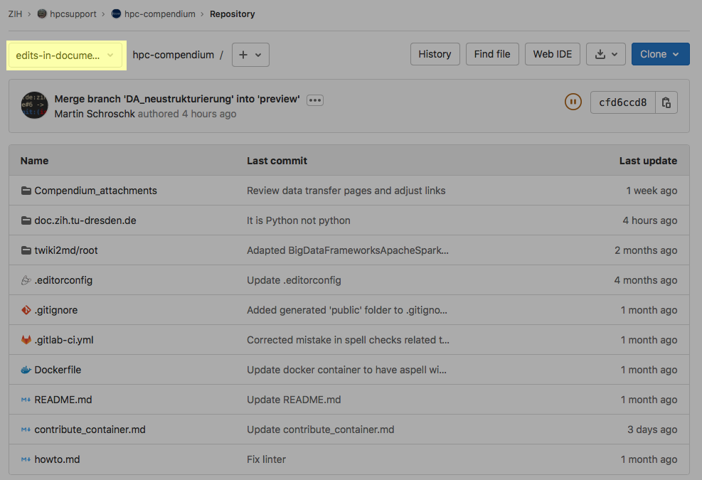
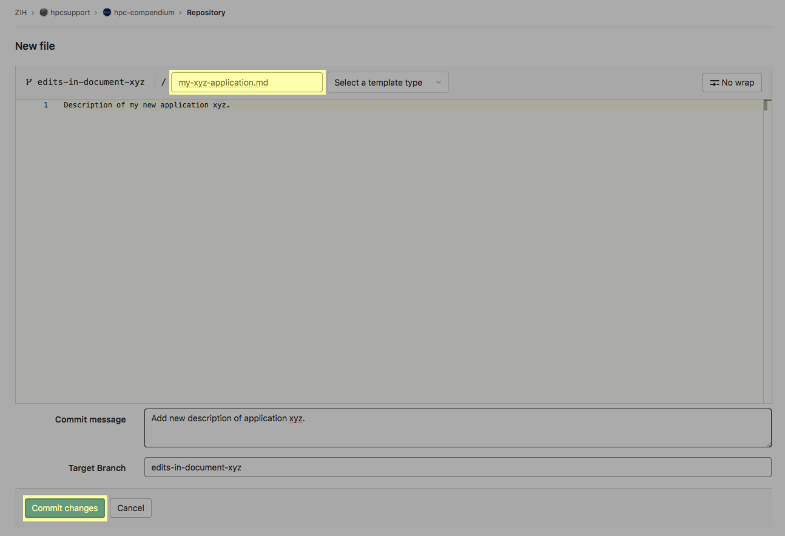
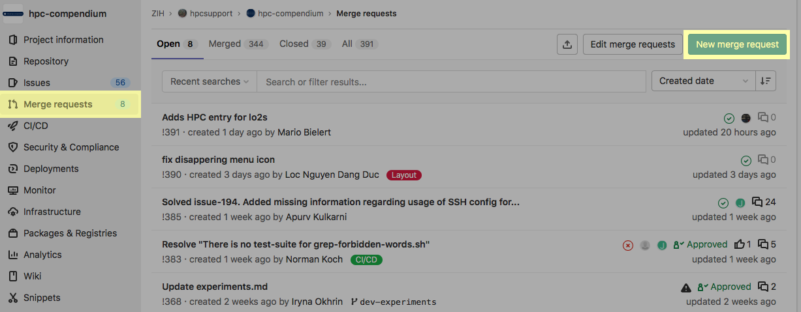

# Contribution Guide for Browser-based Editing

In the following, it is outlined how to contribute to the
[HPC documentation](https://doc.zih.tu-dresden.de/) of
[TU Dresden/ZIH](https://tu-dresden.de/zih/) by means of GitLab's web interface using a standard web
browser only.

## Preparation

First of all, you need an account on [gitlab.hrz.tu-chemnitz.de](https://gitlab.hrz.tu-chemnitz.de).
Secondly, you need access to the project
[ZIH/hpcsupport/hpc-compendium](https://gitlab.hrz.tu-chemnitz.de/zih/hpcsupport/hpc-compendium).

The project is publicly visible, i.e., it is open to the world and any signed-in user has the
[Guest role](https://gitlab.hrz.tu-chemnitz.de/help/user/permissions.md) on this repository. Guests
have only very
[limited permissions](https://gitlab.hrz.tu-chemnitz.de/help/user/permissions.md#project-members-permissions).
In particular, as guest, you can contribute to the documentation by
[creating issues](howto_contribute.md#contribute-via-issue), but you cannot edit files and create
new branches.

To be granted the role **Developer**, please request access by clicking the corresponding button.

Once you are granted the developer role, choose "ZIH/hpcsupport/hpc-compendium" in your project list.

!!! hint "Git basics"

    If you are not familiar with the basics of git-based document revision control yet, please have
    a look at [Gitlab tutorials](https://gitlab.hrz.tu-chemnitz.de/help/gitlab-basics/index.md).

## Create a Branch

Your contribution starts by creating your own branch of the repository that will hold your edits and
additions. Create your branch by clicking on "+" near "preview->hpc-compendium/" as depicted in
the figure and click "New branch".

By default, the new branch should be created from the `preview` branch, as pre-selected.

Define a branch name that briefly describes what you plan to change, e.g., `edits-in-document-xyz`.
Then, click on "Create branch" as depicted in this figure:

As a result, you should now see your branch's name on top of your list of repository files as
depicted here:

## Editing Existing Articles

Navigate the depicted document hierarchy under `doc.zih.tu-dresden.de/docs` until you find the
article to be edited. A click on the article's name opens a textual representation of the article.
In the top right corner of it, you find the button "Edit" to be clicked in order to make changes.
Once you completed your changes, click on "Commit changes". Please add meaningful comment about the
changes you made under "Commit message". Feel free to do as many changes and commits as you wish in
your branch of the repository.

## Adding New Article

Navigate the depicted document hierarchy under `doc.zih.tu-dresden.de/docs` to find a topic that
fits best to your article. To start a completely new article, click on "+ New file" as depicted
here:

Set a file name that corresponds well to your article like `application_xyz.md`.
(The file name should follow the pattern `fancy_title_and_more.md`.)
Once you completed your initial edits, click on "commit".

Finally, the new article needs to be added to the navigation section of the configuration file
`doc.zih.tu-dresden.de/mkdocs.yaml`.

## Submitting Articles for Publication

Once you are satisfied with your edits, you are ready for publication.
Therefore, your edits need to undergo an internal review process and pass the CI/CD pipeline tests.
This process is triggered by creating a "merge request", which serves the purpose of merging your edits
into the `preview` branch of the repository.

* Click on "Merge requests" (in the menu to the left) as depicted below.
* Then, click on the button "New merge request".
* Select your source branch (for example `edits-in-document-xyz`) and click on "Compare branches and
  continue". (The target branch is always `preview`. This is pre-selected - do not change!)
* The next screen will give you an overview of your changes. Please provide a meaningful
  description of the contributions. Once you checked them, click on "Create merge request".

## Revision of Articles

As stated earlier, all changes undergo a review process.
This covers automated checks contained in the CI/CD pipeline and the review by a maintainer.
You can follow this process under
[Merge requests](https://gitlab.hrz.tu-chemnitz.de/zih/hpcsupport/hpc-compendium/-/merge_requests)
(where you initiated your merge request).
If you are asked to make corrections or changes, follow the directions as indicated.
Once your merge request has been accepted, the merge request will be closed and the branch will be deleted.
At this point, there is nothing else to do for you.
Except probably for waiting a little while until your changes become visible on the official web site.
