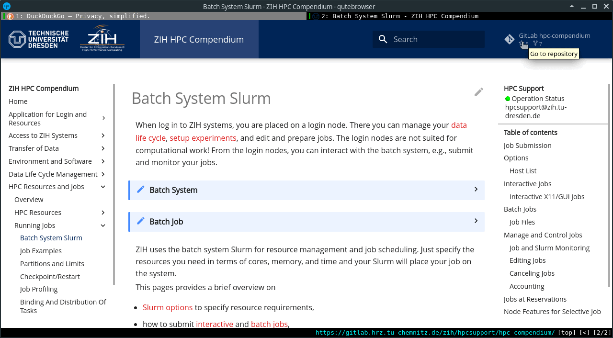

# How-To Contribute

!!! cite "Chinese proverb"

    Ink is better than the best memory.

In principle, there are three possible ways how to contribute to this documentation.

## Contribute via Issue

Users can contribute to the documentation via the
[GitLab issue tracking system](https://gitlab.hrz.tu-chemnitz.de/zih/hpcsupport/hpc-compendium/-/issues).
For that, open an issue to report typos and missing documentation or request for more precise
wording etc. ZIH staff will get in touch with you to resolve the issue and improve the
documentation.

??? tip "Create an issue in GitLab"

    
    {: align=center}

!!! warning "HPC support"

    Non-documentation issues and requests need to be send as ticket to
    [hpcsupport@zih.tu-dresden.de](mailto:hpcsupport@zih.tu-dresden.de).

## Contribute via Web IDE

GitLab offers a rich and versatile web interface to work with repositories. To fix typos and edit
source files, follow these steps:

1. Navigate to the repository at
[https://gitlab.hrz.tu-chemnitz.de/zih/hpcsupport/hpc-compendium](https://gitlab.hrz.tu-chemnitz.de/zih/hpcsupport/hpc-compendium)
and log in.
1. Select the right branch.
1. Select the file of interest in `doc.zih.tu-dresden.de/docs/...` and click the `Edit` button.
1. A text and commit editor are invoked: Do your changes, add a meaningful commit message and commit
   the changes.

The more sophisticated integrated Web IDE is reached from the top level menu of the repository or
by selecting any source file.

Other git services might have an equivalent web interface to interact with the repository. Please
refer to the corresponding documentation for further information.

## Contribute Using Git Locally

For experienced Git users, we provide a Docker container that includes all checks of the CI engine
used in the back-end. Using them should ensure that merge requests will not be blocked
due to automatic checking.
For details, refer to the page [Work Locally Using Containers](contribute_container.md).
