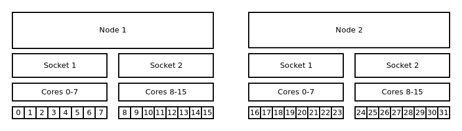
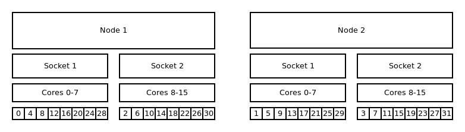
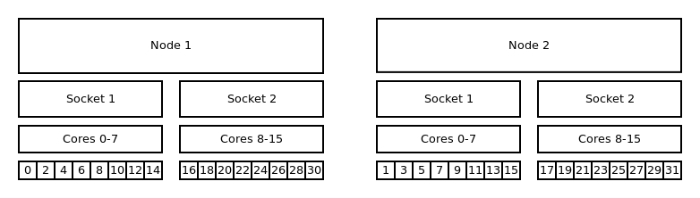
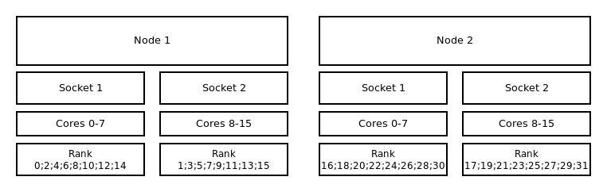
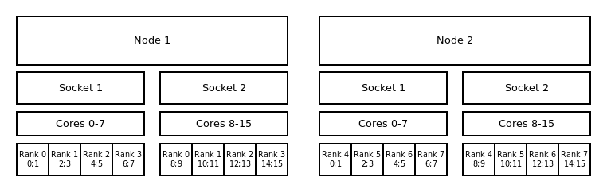
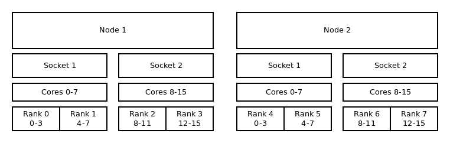
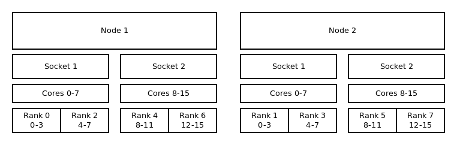

# Binding and Distribution of Tasks

## General

To specify a pattern the commands `--cpu_bind=<cores|sockets>` and `--distribution=<block|cyclic>`
are needed. The option `cpu_bind` defines the resolution in which the tasks will be allocated. While
`--distribution` determinate the order in which the tasks will be allocated to the CPUs. Keep in
mind that the allocation pattern also depends on your specification.

!!! example "Explicitly specify binding and distribution"

    ```bash
    #!/bin/bash
    #SBATCH --nodes=2                        # request 2 nodes
    #SBATCH --cpus-per-task=4                # use 4 cores per task
    #SBATCH --tasks-per-node=4               # allocate 4 tasks per node - 2 per socket

    srun --ntasks 8 --cpus-per-task 4 --cpu_bind=cores --distribution=block:block ./application
    ```

In the following sections there are some selected examples of the combinations between `--cpu_bind`
and `--distribution` for different job types.

## MPI Strategies

### Default Binding and Distribution Pattern

The default binding uses `--cpu_bind=cores` in combination with `--distribution=block:cyclic`. The
default (as well as `block:cyclic`) allocation method will fill up one node after another, while
filling socket one and two in alternation. Resulting in only even ranks on the first socket of each
node and odd on each second socket of each node.


{: align="center"}


!!! example "Default binding and default distribution"

    ```bash
    #!/bin/bash
    #SBATCH --nodes=2
    #SBATCH --tasks-per-node=16
    #SBATCH --cpus-per-task=1

    srun --ntasks 32 ./application
    ```

### Core Bound

Note: With this command the tasks will be bound to a core for the entire runtime of your
application.

#### Distribution: block:block

This method allocates the tasks linearly to the cores.


{: align="center"}

!!! example "Binding to cores and block:block distribution"

    ```bash
    #!/bin/bash
    #SBATCH --nodes=2
    #SBATCH --tasks-per-node=16
    #SBATCH --cpus-per-task=1

    srun --ntasks 32 --cpu_bind=cores --distribution=block:block ./application
    ```

#### Distribution: cyclic:cyclic

`--distribution=cyclic:cyclic` will allocate your tasks to the cores in a
round robin approach. It starts with the first socket of the first node,
then the first socket of the second node until one task is placed on
every first socket of every node. After that it will place a task on
every second socket of every node and so on.


{: align="center"}

!!! example "Binding to cores and cyclic:cyclic distribution"

    ```bash
    #!/bin/bash
    #SBATCH --nodes=2
    #SBATCH --tasks-per-node=16
    #SBATCH --cpus-per-task=1

    srun --ntasks 32 --cpu_bind=cores --distribution=cyclic:cyclic
    ```

#### Distribution: cyclic:block

The cyclic:block distribution will allocate the tasks of your job in
alternation on node level, starting with first node filling the sockets
linearly.


{: align="center"}

!!! example "Binding to cores and cyclic:block distribution"

    ```bash
    #!/bin/bash
    #SBATCH --nodes=2
    #SBATCH --tasks-per-node=16
    #SBATCH --cpus-per-task=1

    srun --ntasks 32 --cpu_bind=cores --distribution=cyclic:block ./application
    ```

### Socket Bound

The general distribution onto the nodes and sockets stays the same. The mayor difference between
socket- and CPU-bound lies within the ability of the OS to move tasks from one core to another
inside a socket while executing the application. These jumps can slow down the execution time of
your application.

#### Default Distribution

The default distribution uses `--cpu_bind=sockets` with `--distribution=block:cyclic`. The default
allocation method (as well as `block:cyclic`) will fill up one node after another, while filling
socket one and two in alternation. Resulting in only even ranks on the first socket of each node and
odd on each second socket of each node.


{: align="center"}

!!! example "Binding to sockets and block:cyclic distribution"

    ```bash
    #!/bin/bash
    #SBATCH --nodes=2
    #SBATCH --tasks-per-node=16
    #SBATCH --cpus-per-task=1

    srun --ntasks 32 -cpu_bind=sockets ./application
    ```

#### Distribution: block:block

This method allocates the tasks linearly to the cores.


{: align="center"}

!!! example "Binding to sockets and block:block distribution"

    ```bash
    #!/bin/bash
    #SBATCH --nodes=2
    #SBATCH --tasks-per-node=16
    #SBATCH --cpus-per-task=1

    srun --ntasks 32 --cpu_bind=sockets --distribution=block:block ./application
    ```

#### Distribution: block:cyclic

The `block:cyclic` distribution will allocate the tasks of your job in
alternation between the first node and the second node while filling the
sockets linearly.


{: align="center"}

!!! example "Binding to sockets and block:cyclic distribution"

    ```bash
    #!/bin/bash
    #SBATCH --nodes=2
    #SBATCh --tasks-per-node=16
    #SBATCH --cpus-per-task=1

    srun --ntasks 32 --cpu_bind=sockets --distribution=block:cyclic ./application
    ```

## Hybrid Strategies

### Default Binding and Distribution Pattern

The default binding pattern of hybrid jobs will split the cores allocated to a rank between the
sockets of a node. The example shows that Rank 0 has 4 cores at its disposal. Two of them on first
socket inside the first node and two on the second socket inside the first node.


{: align="center"}

!!! example "Binding to sockets and block:block distribution"

    ```bash
    #!/bin/bash
    #SBATCH --nodes=2
    #SBATCH --tasks-per-node=4
    #SBATCH --cpus-per-task=4

    export OMP_NUM_THREADS=$SLURM_CPUS_PER_TASK
    srun --ntasks 8 --cpus-per-task $OMP_NUM_THREADS ./application
    ```

### Core Bound

#### Distribution: block:block

This method allocates the tasks linearly to the cores.


{: align="center"}

!!! example "Binding to cores and block:block distribution"

    ```bash
    #!/bin/bash
    #SBATCH --nodes=2
    #SBATCH --tasks-per-node=4
    #SBATCH --cpus-per-task=4

    export OMP_NUM_THREADS=$SLURM_CPUS_PER_TASK
    srun --ntasks 8 --cpus-per-task $OMP_NUM_THREADS --cpu_bind=cores --distribution=block:block ./application
    ```

#### Distribution: cyclic:block

The `cyclic:block` distribution will allocate the tasks of your job in alternation between the first
node and the second node while filling the sockets linearly.


{: align="center"}

!!! example "Binding to cores and cyclic:block distribution"

    ```bash
    #!/bin/bash
    #SBATCH --nodes=2
    #SBATCH --tasks-per-node=4
    #SBATCH --cpus-per-task=4

    export OMP_NUM_THREADS=$SLURM_CPUS_PER_TASK
    srun --ntasks 8 --cpus-per-task $OMP_NUM_THREADS --cpu_bind=cores --distribution=cyclic:block ./application
    ```
