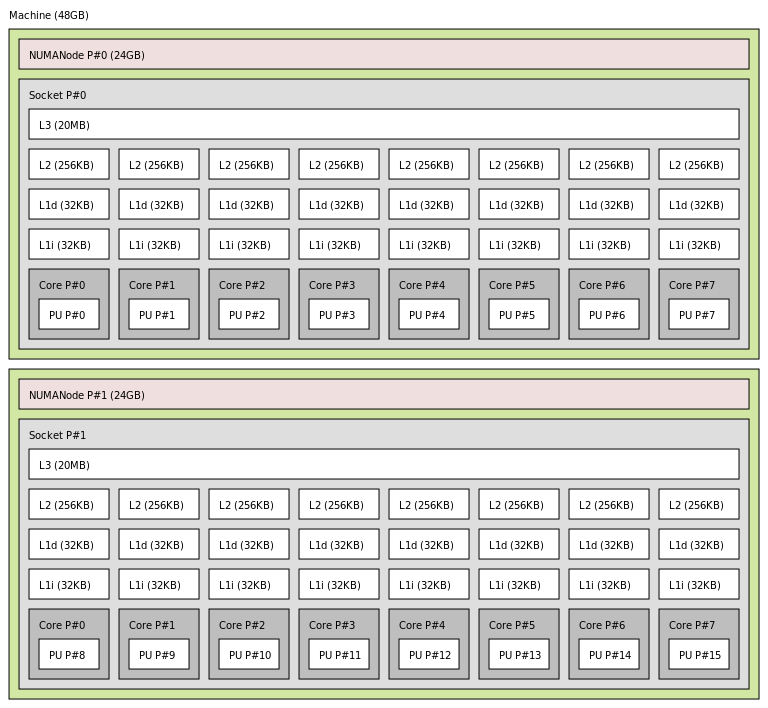

# ZIH Systems

ZIH systems comprises the *High Performance Computing and Storage Complex* and its
extension *High Performance Computing – Data Analytics*. In total it offers scientists
about 60,000 CPU cores and a peak performance of more than 1.5 quadrillion floating point
operations per second. The architecture specifically tailored to data-intensive computing, Big Data
analytics, and artificial intelligence methods with extensive capabilities for energy measurement
and performance monitoring provides ideal conditions to achieve the ambitious research goals of the
users and the ZIH.

## Login Nodes

- Login-Nodes (`tauruslogin[3-6].hrsk.tu-dresden.de`)
  - each with 2x Intel(R) Xeon(R) CPU E5-2680 v3 each with 12 cores
    @ 2.50GHz, Multithreading Disabled, 64 GB RAM, 128 GB SSD local disk
  - IPs: 141.30.73.\[102-105\]
- Transfer-Nodes (`taurusexport3/4.hrsk.tu-dresden.de`, DNS Alias
  `taurusexport.hrsk.tu-dresden.de`)
  - 2 Servers without interactive login, only available via file transfer protocols (`rsync`, `ftp`)
  - IPs: 141.30.73.82/83
- Direct access to these nodes is granted via IP whitelisting (contact
  hpcsupport@zih.tu-dresden.de) - otherwise use TU Dresden VPN.

## AMD Rome CPUs + NVIDIA A100

- 32 nodes, each with
  - 8 x NVIDIA A100-SXM4
  - 2 x AMD EPYC CPU 7352 (24 cores) @ 2.3 GHz, Multithreading disabled
  - 1 TB RAM
  - 3.5 TB local memory at NVMe device at `/tmp`
- Hostnames: `taurusi[8001-8034]`
- Slurm partition `alpha`
- Dedicated mostly for ScaDS-AI

## Island 7 - AMD Rome CPUs

- 192 nodes, each with
  - 2x AMD EPYC CPU 7702 (64 cores) @ 2.0GHz, Multithreading
    enabled,
  - 512 GB RAM
  - 200 GB /tmp on local SSD local disk
- Hostnames: `taurusi[7001-7192]`
- Slurm partition `romeo`
- More information under [Rome Nodes](rome_nodes.md)

## Large SMP System HPE Superdome Flex

- 32 x Intel(R) Xeon(R) Platinum 8276M CPU @ 2.20GHz (28 cores)
- 47 TB RAM
- Currently configured as one single node
  - Hostname: `taurussmp8`
- Slurm partition `julia`
- More information under [HPE SD Flex](sd_flex.md)

## IBM Power9 Nodes for Machine Learning

For machine learning, we have 32 IBM AC922 nodes installed with this configuration:

- 2 x IBM Power9 CPU (2.80 GHz, 3.10 GHz boost, 22 cores)
- 256 GB RAM DDR4 2666MHz
- 6x NVIDIA VOLTA V100 with 32GB HBM2
- NVLINK bandwidth 150 GB/s between GPUs and host
- Slurm partition `ml`
- Hostnames: `taurusml[1-32]`

## Island 4 to 6 - Intel Haswell CPUs

- 1456 nodes, each with 2x Intel(R) Xeon(R) CPU E5-2680 v3 (12 cores)
  @ 2.50GHz, Multithreading disabled, 128 GB SSD local disk
- Hostname: `taurusi4[001-232]`, `taurusi5[001-612]`,
  `taurusi6[001-612]`
- Varying amounts of main memory (selected automatically by the batch
  system for you according to your job requirements)
  - 1328 nodes with 2.67 GB RAM per core (64 GB total):
    `taurusi[4001-4104,5001-5612,6001-6612]`
  - 84 nodes with 5.34 GB RAM per core (128 GB total):
    `taurusi[4105-4188]`
  - 44 nodes with 10.67 GB RAM per core (256 GB total):
    `taurusi[4189-4232]`
- Slurm Partition `haswell`

??? hint "Node topology"

    
    {: align=center}

### Extension of Island 4 with Broadwell CPUs

* 32 nodes, each witch 2 x Intel(R) Xeon(R) CPU E5-2680 v4 @ 2.40GHz
  (**14 cores**), Multithreading disabled, 64 GB RAM, 256 GB SSD local disk
* from the users' perspective: Broadwell is like Haswell
* Hostname: `taurusi[4233-4264]`
* Slurm partition `broadwell`

## Island 2 Phase 2 - Intel Haswell CPUs + NVIDIA K80 GPUs

* 64 nodes, each with 2x Intel(R) Xeon(R) CPU E5-E5-2680 v3 (12 cores)
  @ 2.50GHz, Multithreading Disabled, 64 GB RAM (2.67 GB per core),
  128 GB SSD local disk, 4x NVIDIA Tesla K80 (12 GB GDDR RAM) GPUs
* Hostname: `taurusi2[045-108]`
* Slurm Partition `gpu`
* Node topology, same as [island 4 - 6](#island-4-to-6-intel-haswell-cpus)

## SMP Nodes - up to 2 TB RAM

- 5 Nodes each with 4x Intel(R) Xeon(R) CPU E7-4850 v3 (14 cores) @
  2.20GHz, Multithreading Disabled, 2 TB RAM
  - Hostname: `taurussmp[3-7]`
  - Slurm partition `smp2`

??? hint "Node topology"

    
    {: align=center}

## Island 2 Phase 1 - Intel Sandybridge CPUs + NVIDIA K20x GPUs

- 44 nodes, each with 2x Intel(R) Xeon(R) CPU E5-2450 (8 cores) @
  2.10GHz, Multithreading Disabled, 48 GB RAM (3 GB per core), 128 GB
  SSD local disk, 2x NVIDIA Tesla K20x (6 GB GDDR RAM) GPUs
- Hostname: `taurusi2[001-044]`
- Slurm partition `gpu1`

??? hint "Node topology"

    
    {: align=center}
