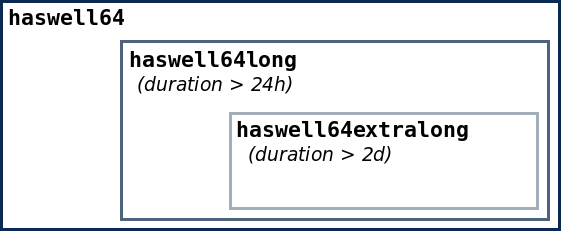

# Partitions, Memory and Run Time Limits

There is no such thing as free lunch at ZIH systems. Since, compute nodes are operated in multi-user
node by default, jobs of several users can run at the same time at the very same node sharing
resources, like memory (but not CPU). On the other hand, a higher throughput can be achieved by
smaller jobs. Thus, restrictions w.r.t. [memory](#memory-limits) and
[runtime limits](#runtime-limits) have to be respected when submitting jobs.

## Runtime Limits

!!! note "Runtime limits are enforced."

    This means, a job will be canceled as soon as it exceeds its requested limit. Currently, the
    maximum run time is 7 days.

Shorter jobs come with multiple advantages:

- lower risk of loss of computing time,
- shorter waiting time for scheduling,
- higher job fluctuation; thus, jobs with high priorities may start faster.

To bring down the percentage of long running jobs we restrict the number of cores with jobs longer
than 2 days to approximately 50% and with jobs longer than 24 to 75% of the total number of cores.
(These numbers are subject to changes.) As best practice we advise a run time of about 8h.

!!! hint "Please always try to make a good estimation of your needed time limit."

    For this, you can use a command line like this to compare the requested timelimit with the
    elapsed time for your completed jobs that started after a given date:

    ```console
    marie@login$ sacct -X -S 2021-01-01 -E now --format=start,JobID,jobname,elapsed,timelimit -s COMPLETED
    ```

Instead of running one long job, you should split it up into a chain job. Even applications that are
not capable of checkpoint/restart can be adapted. Please refer to the section
[Checkpoint/Restart](../jobs_and_resources/checkpoint_restart.md) for further documentation.


{: align="center"}

## Memory Limits

!!! note "Memory limits are enforced."

    This means that jobs which exceed their per-node memory limit will be killed automatically by
    the batch system.

Memory requirements for your job can be specified via the `sbatch/srun` parameters:

`--mem-per-cpu=<MB>` or `--mem=<MB>` (which is "memory per node"). The **default limit** is quite
low at **300 MB** per CPU.

ZIH systems comprises different sets of nodes with different amount of installed memory which affect
where your job may be run. To achieve the shortest possible waiting time for your jobs, you should
be aware of the limits shown in the following table.

??? hint "Partitions and memory limits"

    | Partition          | Nodes                                    | # Nodes | Cores per Node  | MB per Core | MB per Node | GPUs per Node     |
    |:-------------------|:-----------------------------------------|:--------|:----------------|:------------|:------------|:------------------|
    | `haswell64`        | `taurusi[4001-4104,5001-5612,6001-6612]` | `1328`  | `24`            | `2541`       | `61000`    | `-`               |
    | `haswell128`       | `taurusi[4105-4188]`                     | `84`    | `24`            | `5250`       | `126000`   | `-`               |
    | `haswell256`       | `taurusi[4189-4232]`                     | `44`    | `24`            | `10583`      | `254000`   | `-`               |
    | `broadwell`        | `taurusi[4233-4264]`                     | `32`    | `28`            | `2214`       | `62000`    | `-`               |
    | `smp2`             | `taurussmp[3-7]`                         | `5`     | `56`            | `36500`      | `2044000`  | `-`               |
    | `gpu2`             | `taurusi[2045-2106]`                     | `62`    | `24`            | `2583`       | `62000`    | `4 (2 dual GPUs)` |
    | `gpu2-interactive` | `taurusi[2045-2108]`                     | `64`    | `24`            | `2583`       | `62000`    | `4 (2 dual GPUs)` |
    | `hpdlf`            | `taurusa[3-16]`                          | `14`    | `12`            | `7916`       | `95000`    | `3`               |
    | `ml`               | `taurusml[1-32]`                         | `32`    | `44 (HT: 176)`  | `1443*`      | `254000`   | `6`               |
    | `romeo`            | `taurusi[7001-7192]`                     | `192`   | `128 (HT: 256)` | `1972*`      | `505000`   | `-`               |
    | `julia`            | `taurussmp8`                             | `1`     | `896`           | `27343*`     | `49000000` | `-`               |

!!! note

    The ML nodes have 4way-SMT, so for every physical core allocated (,e.g., with
    `SLURM_HINT=nomultithread`), you will always get 4*1443 MB because the memory of the other
    threads is allocated implicitly, too.
