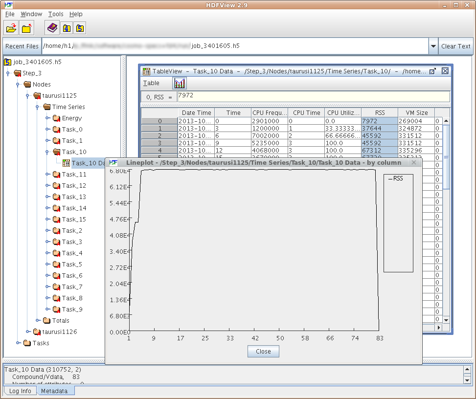

# Job Profiling


{: align="center"}

Slurm offers the option to gather profiling data from every task/node of the job. Following data can
be gathered:

- Task data, such as CPU frequency, CPU utilization, memory
  consumption (RSS and VMSize), I/O
- Energy consumption of the nodes
- Infiniband data (currently deactivated)
- Lustre filesystem data (currently deactivated)

The data is sampled at a fixed rate (i.e. every 5 seconds) and is stored in a HDF5 file.

**CAUTION**: Please be aware that the profiling data may be quiet large, depending on job size,
runtime, and sampling rate. Always remove the local profiles from
`/lustre/scratch2/profiling/${USER}`, either by running sh5util as shown above or by simply removing
those files.

Usage examples:

```console
# create energy and task profiling data (--acctg-freq is the sampling rate in seconds)
srun --profile=All --acctg-freq=5,energy=5 -n 32 ./a.out
# create task profiling data only
srun --profile=All --acctg-freq=5 -n 32 ./a.out

# merge the node local files in /lustre/scratch2/profiling/${USER} to single file
# (without -o option output file defaults to job_&lt;JOBID&gt;.h5)
sh5util -j &lt;JOBID&gt; -o profile.h5
# in jobscripts or in interactive sessions (via salloc):
sh5util -j ${SLURM_JOBID} -o profile.h5

# view data:
module load HDFView
hdfview.sh profile.h5
```

More information about profiling with Slurm:

- [Slurm Profiling](http://slurm.schedmd.com/hdf5_profile_user_guide.html)
- [sh5util](http://slurm.schedmd.com/sh5util.html)
