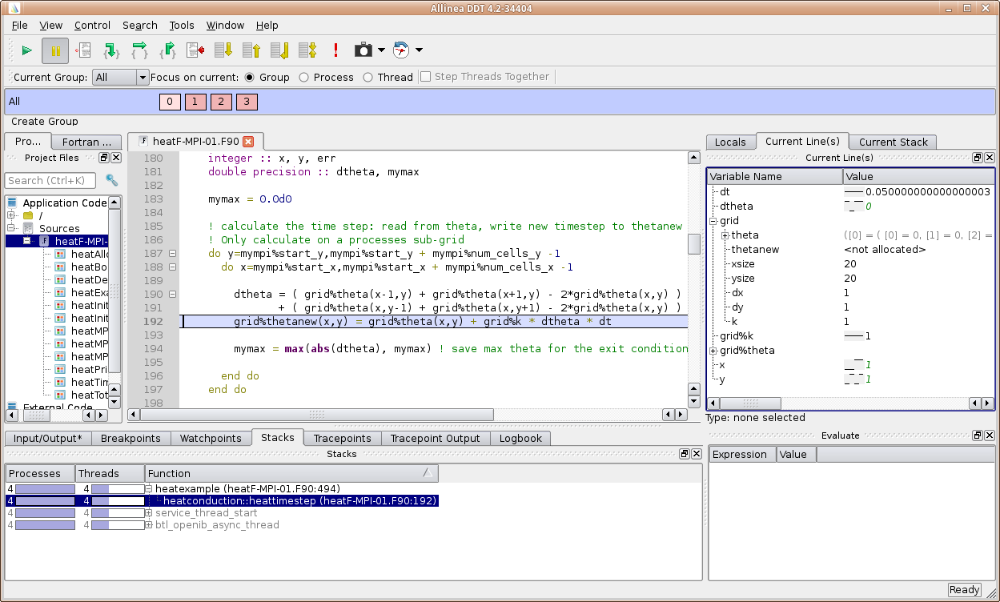

# Debugging

Debugging is an essential but also rather time consuming step during application development. Tools
dramatically reduce the amount of time spent to detect errors. Besides the "classical" serial
programming errors, which may usually be easily detected with a regular debugger, there exist
programming errors that result from the usage of OpenMP, Pthreads, or MPI. These errors may also be
detected with debuggers (preferably debuggers with support for parallel applications), however,
specialized tools like MPI checking tools (e.g. Marmot) or thread checking tools (e.g. Intel Thread
Checker) can simplify this task.

This page provides detailed information on classic debugging at ZIH systems.  The more specific
topic [MPI Usage Error Detection](mpi_usage_error_detection.md) covers tools to detect MPI usage
errors.

## Overview of available Debuggers at ZIH

| | GDB | Arm DDT  |
|---|:---|:---|
| Interface          | Command line   | Graphical user interface |
| Languages          | C/C++, Fortran | C/C++, Fortran, Python (limited) |
| Parallel Debugging | Threads        | Threads, MPI, GPU, hybrid |
| Licenses at ZIH    | Free           | 1024 (max. number of processes/threads) |
| Official documentation | [GDB website](https://www.gnu.org/software/gdb/) | [Arm DDT website](https://developer.arm.com/tools-and-software/server-and-hpc/debug-and-profile/arm-forge/arm-ddt) |

## General Advices

- You need to compile your code with the flag `-g` to enable
  debugging. This tells the compiler to include information about
  variable and function names, source code lines etc. into the
  executable.
- It is also recommendable to reduce or even disable optimizations
  (`-O0` or gcc's `-Og`). At least inlining should be disabled (usually
  `-fno-inline`).
- For parallel applications: try to reproduce the problem with less
  processes or threads before using a parallel debugger.
- Use the compiler's check capabilities to find typical problems at
  compile time or run time, read the manual (`man gcc`, `man ifort`, etc.)
  - Intel C++ example: `icpc -g -std=c++14 -w3 -check=stack,uninit -check-pointers=rw -fp-trap=all`
  - Intel Fortran example: `ifort -g -std03 -warn all -check all -fpe-all=0 -traceback`
  - The flag `-traceback` of the Intel Fortran compiler causes to print
    stack trace and source code location when the program terminates
    abnormally.
- If your program crashes and you get an address of the failing
  instruction, you can get the source code line with the command
  `addr2line -e <executable> <address>` (if compiled with `-g`).
- Use [Memory Debuggers](#memory-debugging) to
  verify the proper usage of memory.
- Core dumps are useful when your program crashes after a long
  runtime.
- Slides from user training: [Introduction to Parallel Debugging](misc/debugging_intro.pdf)

## GNU Debugger (GDB)

The GNU Debugger (GDB) offers only limited to no support for parallel
applications and Fortran 90. However, it might be the debugger you are
most used to. GDB works best for serial programs. You can start GDB in
several ways:

|                               | Command                        |
|-------------------------------|:-------------------------------|
| Run program under GDB         | `gdb <executable>`             |
| Attach running program to GDB | `gdb --pid <process ID>`       |
| Open a core dump              | `gdb <executable> <core file>` |

This [GDB Reference Sheet](http://users.ece.utexas.edu/~adnan/gdb-refcard.pdf) makes life easier
when you often use GDB.

Fortran 90 programmers may issue an `module load ddt` before their debug session. This makes the GDB
modified by DDT available, which has better support for Fortran 90 (e.g.  derived types).

## Arm DDT



- Intuitive graphical user interface and great support for parallel applications
- We have 1024 licenses, so many user can use this tool for parallel debugging
- Don't expect that debugging an MPI program with hundreds of processes will always work without
  problems
  - The more processes and nodes involved, the higher is the probability for timeouts or other
    problems
  - Debug with as few processes as required to reproduce the bug you want to find
- Module to load before using: `module load ddt` Start: `ddt <executable>` If the GUI runs too slow
- over your remote connection:
  Use [WebVNC](../access/graphical_applications_with_webvnc.md) to start a remote desktop session in
  a web browser.
- Slides from user training: [Parallel Debugging with DDT](misc/debugging_ddt.pdf)

### Serial Program Example

```console
marie@login$ module load ddt
Module ddt/20.2.1-Redhat-7.0 loaded.
marie@login$ srun --pty --x11=first -n 1 --time=2:00:00 bash
srun: job 123456 queued and waiting for resources
srun: job 123456 has been allocated resources
marie@compute$ ddt ./myprog
```

- Run dialog window of DDT opens.
- Optionally: configure options like program arguments.
- Hit *Run*.

### Multi-threaded Program Example

```console
marie@login$ module load ddt
Module ddt/20.2.1-Redhat-7.0 loaded.
marie@login$ srun --pty --x11=first -n 1 -c <number of threads> --time=2:00:00 bash
srun: job 123457 queued and waiting for resources
srun: job 123457 has been allocated resources
marie@compute$ ddt ./myprog
```

- Run dialog window of DDT opens.
- Optionally: configure options like program arguments.
- If OpenMP: set number of threads.
- Hit *Run*.

### MPI-Parallel Program Example

```console
marie@login$ module load ddt
Module ddt/20.2.1-Redhat-7.0 loaded.
marie@login$ salloc --x11=first -n <number of processes> --time=2:00:00
salloc: Pending job allocation 123458
salloc: job 123458 queued and waiting for resources
salloc: job 123458 has been allocated resources
salloc: Granted job allocation 123458
marie@login$ ddt srun ./myprog
```

- Run dialog window of DDT opens.
- If MPI-OpenMP-hybrid: set number of threads.
- Hit *Run*

## Memory Debugging

- Memory debuggers find memory management bugs, e.g.
  - Use of non-initialized memory
  - Access memory out of allocated bounds
- DDT has memory debugging included (needs to be enabled in the run dialog)

### Valgrind (Memcheck)

- Simulation of the program run in a virtual machine which accurately observes memory operations.
- Extreme run time slow-down: use small program runs!
- Finds more memory errors than other debuggers.
- Further information:
  - [Valgrind Website](http://www.valgrind.org)
  - [Memcheck Manual](https://www.valgrind.org/docs/manual/mc-manual.html)
    (explanation of output, command-line options)
- For serial or multi-threaded programs:

```console
marie@login$ module load Valgrind
Module Valgrind/3.14.0-foss-2018b and 12 dependencies loaded.
marie@login$ srun -n 1 valgrind ./myprog
```

- Not recommended for MPI parallel programs, since usually the MPI library will throw
  a lot of errors. But you may use Valgrind the following way such that every rank
  writes its own Valgrind log file:

```console
marie@login$ module load Valgrind
Module Valgrind/3.14.0-foss-2018b and 12 dependencies loaded.
marie@login$ srun -n <number of processes> valgrind --log-file=valgrind-%p.out ./myprog
```
