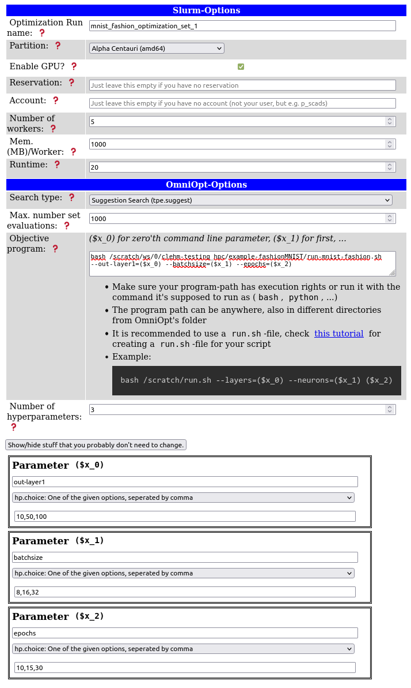
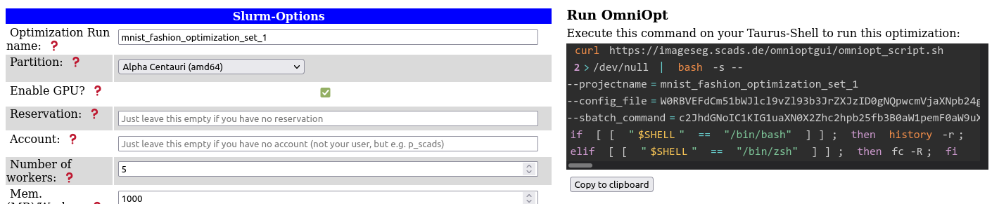
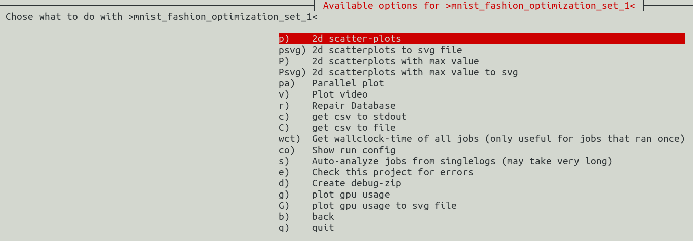
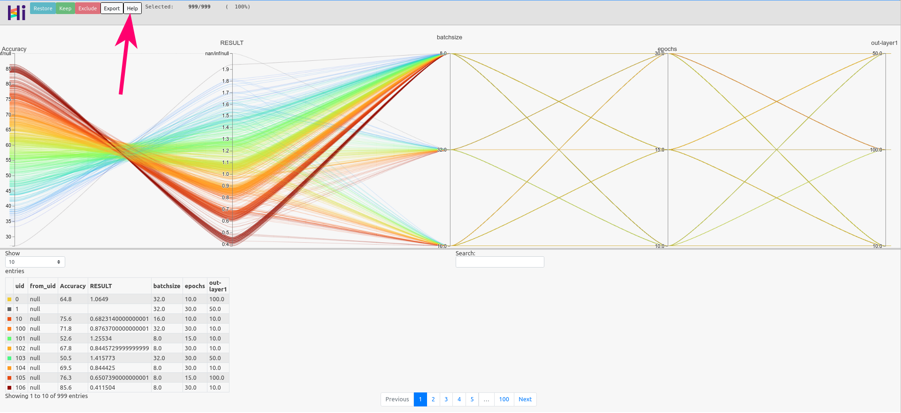

# Hyperparameter Optimization (OmniOpt)

Classical simulation methods as well as machine learning methods (e.g. neural networks) have a large
number of hyperparameters that significantly determine the accuracy, efficiency, and transferability
of the method. In classical simulations, the hyperparameters are usually determined by adaptation to
measured values. Esp. in neural networks, the hyperparameters determine the network architecture:
number and type of layers, number of neurons, activation functions, measures against overfitting
etc. The most common methods to determine hyperparameters are intuitive testing, grid search or
random search.

The tool OmniOpt performs hyperparameter optimization within a broad range of applications as
classical simulations or machine learning algorithms. OmniOpt is robust and it checks and installs
all dependencies automatically and fixes many problems in the background. While OmniOpt optimizes,
no further intervention is required. You can follow the ongoing output live in the console.
Overhead of OmniOpt is minimal and virtually imperceptible.

## Quick start with OmniOpt

The following instructions demonstrate the basic usage of OmniOpt on the ZIH system, based on the
hyperparameter optimization for a neural network.

The typical OmniOpt workflow comprises at least the following steps:

1. [Prepare application script and software environment](#prepare-application-script-and-software-environment)
1. [Configure and run OmniOpt](#configure-and-run-omniopt)
1. [Check and evaluate OmniOpt results](#check-and-evaluate-omniopt-results)

### Prepare Application Script and Software Environment

The following example application script was created from
[https://pytorch.org/tutorials/beginner/basics/quickstart_tutorial.html](https://pytorch.org/tutorials/beginner/basics/quickstart_tutorial.html)
as a starting point.
Therein, a neural network is trained on the MNIST Fashion data set.

There are the following script preparation steps for OmniOpt:

1. Changing hard-coded hyperparameters (chosen here: batch size, epochs, size of layer 1 and 2) into
   command line parameters.  Esp. for this example, the Python module `argparse` (see the docs at
   [https://docs.python.org/3/library/argparse.html](https://docs.python.org/3/library/argparse.html)
   is used.

    ??? note "Parsing arguments in Python"
        There are many ways for parsing arguments into Python scripts. The easiest approach is
        the `sys` module (see
        [www.geeksforgeeks.org/how-to-use-sys-argv-in-python](https://www.geeksforgeeks.org/how-to-use-sys-argv-in-python)),
        which would be fully sufficient for usage with OmniOpt. Nevertheless, this basic approach
        has no consistency checks or error handling etc.

1. Mark the output of the optimization target (chosen here: average loss) by prefixing it with the
   RESULT string. OmniOpt takes the **last appearing value** prefixed with the RESULT string. In
   the example, different epochs are performed and the average from the last epoch is caught by
   OmniOpt. Additionally, the `RESULT` output has to be a **single line**. After all these changes,
   the final script is as follows (with the lines containing relevant changes highlighted).

    ??? example "Final modified Python script: MNIST Fashion "

        ```python linenums="1" hl_lines="18-33 52-53 66-68 72 74 76 85 125-126"
        #!/usr/bin/env python
        # coding: utf-8

        # # Example for using OmniOpt
        #
        # source code taken from: https://pytorch.org/tutorials/beginner/basics/quickstart_tutorial.html
        # parameters under consideration:#
        # 1. batch size
        # 2. epochs
        # 3. size output layer 1
        # 4. size output layer 2

        import torch
        from torch import nn
        from torch.utils.data import DataLoader
        from torchvision import datasets
        from torchvision.transforms import ToTensor, Lambda, Compose
        import argparse

        # parsing hpyerparameters as arguments
        parser = argparse.ArgumentParser(description="Demo application for OmniOpt for hyperparameter optimization, example: neural network on MNIST fashion data.")

        parser.add_argument("--out-layer1", type=int, help="the number of outputs of layer 1", default = 512)
        parser.add_argument("--out-layer2", type=int, help="the number of outputs of layer 2", default = 512)
        parser.add_argument("--batchsize", type=int, help="batchsize for training", default = 64)
        parser.add_argument("--epochs", type=int, help="number of epochs", default = 5)

        args = parser.parse_args()

        batch_size = args.batchsize
        epochs = args.epochs
        num_nodes_out1 = args.out_layer1
        num_nodes_out2 = args.out_layer2

        # Download training data from open data sets.
        training_data = datasets.FashionMNIST(
            root="data",
            train=True,
            download=True,
            transform=ToTensor(),
        )

        # Download test data from open data sets.
        test_data = datasets.FashionMNIST(
            root="data",
            train=False,
            download=True,
            transform=ToTensor(),
        )

        # Create data loaders.
        train_dataloader = DataLoader(training_data, batch_size=batch_size)
        test_dataloader = DataLoader(test_data, batch_size=batch_size)

        for X, y in test_dataloader:
            print("Shape of X [N, C, H, W]: ", X.shape)
            print("Shape of y: ", y.shape, y.dtype)
            break

        # Get cpu or gpu device for training.
        device = "cuda" if torch.cuda.is_available() else "cpu"
        print("Using {} device".format(device))

        # Define model
        class NeuralNetwork(nn.Module):
            def __init__(self, out1, out2):
                self.o1 = out1
                self.o2 = out2
                super(NeuralNetwork, self).__init__()
                self.flatten = nn.Flatten()
                self.linear_relu_stack = nn.Sequential(
                    nn.Linear(28*28, out1),
                    nn.ReLU(),
                    nn.Linear(out1, out2),
                    nn.ReLU(),
                    nn.Linear(out2, 10),
                    nn.ReLU()
                )

            def forward(self, x):
                x = self.flatten(x)
                logits = self.linear_relu_stack(x)
                return logits

        model = NeuralNetwork(out1=num_nodes_out1, out2=num_nodes_out2).to(device)
        print(model)

        loss_fn = nn.CrossEntropyLoss()
        optimizer = torch.optim.SGD(model.parameters(), lr=1e-3)

        def train(dataloader, model, loss_fn, optimizer):
            size = len(dataloader.dataset)
            for batch, (X, y) in enumerate(dataloader):
                X, y = X.to(device), y.to(device)

                # Compute prediction error
                pred = model(X)
                loss = loss_fn(pred, y)

                # Backpropagation
                optimizer.zero_grad()
                loss.backward()
                optimizer.step()

                if batch % 200 == 0:
                    loss, current = loss.item(), batch * len(X)
                    print(f"loss: {loss:>7f}  [{current:>5d}/{size:>5d}]")

        def test(dataloader, model, loss_fn):
            size = len(dataloader.dataset)
            num_batches = len(dataloader)
            model.eval()
            test_loss, correct = 0, 0
            with torch.no_grad():
                for X, y in dataloader:
                    X, y = X.to(device), y.to(device)
                    pred = model(X)
                    test_loss += loss_fn(pred, y).item()
                    correct += (pred.argmax(1) == y).type(torch.float).sum().item()
            test_loss /= num_batches
            correct /= size
            print(f"Test Error: \n Accuracy: {(100*correct):>0.1f}%, Avg loss: {test_loss:>8f} \n")


            #print statement esp. for OmniOpt (single line!!)
            print(f"RESULT: {test_loss:>8f} \n")

        for t in range(epochs):
            print(f"Epoch {t+1}\n-------------------------------")
            train(train_dataloader, model, loss_fn, optimizer)
            test(test_dataloader, model, loss_fn)
        print("Done!")
        ```

1. Testing script functionality and determine software requirements for the chosen
   [partition](../jobs_and_resources/partitions_and_limits.md). In the following, the alpha
   partition is used. Please note the parameters `--out-layer1`, `--batchsize`, `--epochs` when
   calling the Python script. Additionally, note the `RESULT` string with the output for OmniOpt.

    ??? hint "Hint for installing Python modules"

        Note that for this example the module `torchvision` is not available on the partition `alpha`
        and it is installed by creating a [virtual environment](python_virtual_environments.md). It is
        recommended to install such a virtual environment into a
        [workspace](../data_lifecycle/workspaces.md).

        ```console
        marie@login$ module load modenv/hiera  GCC/10.2.0  CUDA/11.1.1 OpenMPI/4.0.5 PyTorch/1.9.0
        marie@login$ mkdir </path/to/workspace/python-environments>    #create folder
        marie@login$ virtualenv --system-site-packages </path/to/workspace/python-environments/torchvision_env>
        marie@login$ source </path/to/workspace/python-environments/torchvision_env>/bin/activate #activate virtual environment
        marie@login$ pip install torchvision #install torchvision module
        ```

    ```console
    # Job submission on alpha nodes with 1 GPU on 1 node with 800 MB per CPU
    marie@login$ srun -p alpha --gres=gpu:1 -n 1 -c 7 --pty --mem-per-cpu=800 bash
    marie@alpha$ module load modenv/hiera  GCC/10.2.0  CUDA/11.1.1 OpenMPI/4.0.5 PyTorch/1.9.0
    # Activate virtual environment
    marie@alpha$ source </path/to/workspace/python-environments/torchvision_env>/bin/activate
    The following have been reloaded with a version change:
      1) modenv/scs5 => modenv/hiera

    Module GCC/10.2.0, CUDA/11.1.1, OpenMPI/4.0.5, PyTorch/1.9.0 and 54 dependencies loaded.
    marie@alpha$ python </path/to/your/script/mnistFashion.py> --out-layer1=200 --batchsize=10 --epochs=3
    [...]
    Epoch 3
    -------------------------------
    loss: 1.422406  [    0/60000]
    loss: 0.852647  [10000/60000]
    loss: 1.139685  [20000/60000]
    loss: 0.572221  [30000/60000]
    loss: 1.516888  [40000/60000]
    loss: 0.445737  [50000/60000]
    Test Error:
     Accuracy: 69.5%, Avg loss: 0.878329

    RESULT: 0.878329

    Done!
    ```

Using the modified script within OmniOpt requires configuring and loading of the software
environment. The recommended way is to wrap the necessary calls in a shell script.

??? example "Example for wrapping with shell script"

    ```bash
    #!/bin/bash -l
    # ^ Shebang-Line, so that it is known that this is a bash file
    # -l means 'load this as login shell', so that /etc/profile gets loaded and you can use 'module load' or 'ml' as usual

    # If you don't use this script via `./run.sh' or just `srun run.sh', but like `srun bash run.sh', please add the '-l' there too.
    # Like this:
    # srun bash -l run.sh

    # Load modules your program needs, always specify versions!
    module load modenv/hiera GCC/10.2.0 CUDA/11.1.1 OpenMPI/4.0.5 PyTorch/1.7.1
    source </path/to/workspace/python-environments/torchvision_env>/bin/activate #activate virtual environment

    # Load your script. $@ is all the parameters that are given to this shell file.
    python </path/to/your/script/mnistFashion.py> $@
    ```

When the wrapped shell script is running properly, the preparations are finished and the next step
is configuring OmniOpt.

### Configure and Run OmniOpt

Configuring OmniOpt is done via the GUI at
[https://imageseg.scads.ai/omnioptgui/](https://imageseg.scads.ai/omnioptgui/).
This GUI guides through the configuration process and as result a configuration file is created
automatically according to the GUI input. If you are more familiar with using OmniOpt later on,
this configuration file can be modified directly without using the GUI.

A screenshot of
[the GUI](https://imageseg.scads.ai/omnioptgui/?maxevalserror=5&mem_per_worker=1000&number_of_parameters=3&param_0_values=10%2C50%2C100&param_1_values=8%2C16%2C32&param_2_values=10%2C15%2C30&param_0_name=out-layer1&param_1_name=batchsize&param_2_name=batchsize&account=&projectname=mnist_fashion_optimization_set_1&partition=alpha&searchtype=tpe.suggest&param_0_type=hp.choice&param_1_type=hp.choice&param_2_type=hp.choice&max_evals=1000&objective_program=bash%20%3C%2Fpath%2Fto%2Fwrapper-script%2Frun-mnist-fashion.sh%3E%20--out-layer1%3D%28%24x_0%29%20--batchsize%3D%28%24x_1%29%20--epochs%3D%28%24x_2%29&workdir=%3C%2Fscratch%2Fws%2Fomniopt-workdir%2F%3E),
including a properly configuration for the MNIST fashion example is shown below.

Please modify the paths for `objective program` and `workdir` according to your needs.


{: align="center"}

Using OmniOpt for a first trial example, it is often sufficient to concentrate on the following
configuration parameters:

1. **Optimization run name:** A name for an OmniOpt run given a belonging configuration.
1. **Partition:** Choose the partition on the ZIH system that fits the programs' needs.
1. **Enable GPU:** Decide whether a program could benefit from GPU usage or not.
1. **Workdir:** The directory where OmniOpt is saving its necessary files and all results. Derived
   from the optimization run name, each configuration creates a single directory.
   Make sure that this working directory is writable from the compute nodes. It is recommended to
   use a [workspace](../data_lifecycle/workspaces.md).
1. **Objective program:** Provide all information for program execution. Typically, this will
   contain the command for executing a wrapper script.
1. **Parameters:** The hyperparameters to be optimized with the names OmniOpt should use. For the
   example here, the variable names are identical to the input parameters of the Python script.
   However, these names can be chosen differently, since the connection to OmniOpt is realized via
   the variables (`$x_0`), (`$x_1`), etc. from the GUI section "Objective program". Please note that
   it is not necessary to name the parameters explicitly in your script but only within the OmniOpt
   configuration.

After all parameters are entered into the GUI, the call for OmniOpt is generated automatically and
displayed on the right. This command contains all necessary instructions (including requesting
resources with Slurm). **Thus, this command can be executed directly on a login node on the ZIH
system.**


{: align="center"}

After executing this command OmniOpt is doing all the magic in the background and there are no
further actions necessary.

??? hint "Hints on the working directory"

    1. Starting OmniOpt without providing a working directory will store OmniOpt into the present directory.
    1. Within the given working directory, a new folder named "omniopt" as default, is created.
    1. Within one OmniOpt working directory, there can be multiple optimization projects.
    1. It is possible to have as many working directories as you want (with multiple optimization runs).
    1. It is recommended to use a [workspace](../data_lifecycle/workspaces.md) as working directory, but not the home directory.

### Check and Evaluate OmniOpt Results

For getting informed about the current status of OmniOpt or for looking into results, the evaluation
tool of OmniOpt is used. Switch to the OmniOpt folder and run `evaluate-run.sh`.

``` console
marie@login$ bash </scratch/ws/omniopt-workdir/>evaluate-run.sh
```

After initializing and checking for updates in the background, OmniOpt is asking to select the
optimization run of interest.  After selecting the optimization run, there will be a menu with the
items as shown below.  If OmniOpt has still running jobs there appear some menu items that refer to
these running jobs (image shown below to the right).

evaluation options (all jobs finished)                            |  evaluation options (still running jobs)
:--------------------------------------------------------------:|:-------------------------:
  |  

For now, we assume that OmniOpt has finished already.
In order to look into the results, there are the following basic approaches.

1. **Graphical approach:**
    There are basically two graphical approaches: two dimensional scatter plots and parallel plots.

    Below there is shown a parallel plot from the MNIST fashion example.
    {: align="center"}

    ??? hint "Hints on parallel plots"

        Parallel plots are suitable especially for dealing with multiple dimensions. The parallel
        plot created by OmniOpt is an interactive `html` file that is stored in the OminOpt working
        directory under `projects/<name_of_optimization_run>/parallel-plot`. The interactivity
        of this plot is intended to make optimal combinations of the hyperparameters visible more
        easily. Get more information about this interactivity by clicking the "Help" button at the
        top of the graphic (see red arrow on the image above).

    After creating a 2D scatter plot or a parallel plot, OmniOpt will try to display the
    corresponding file (`html`, `png`) directly on the ZIH system. Therefore, it is necessary to
    login via ssh with the option `-X` (X11 forwarding), e.g., `ssh -X taurus.hrsk.tu-dresden.de`.
    Nevertheless, because of latency using x11 forwarding, it is recommended to download the created
    files and explore them on the local machine (esp. for the parallel plot). The created files are
    saved at `projects/<name_of_optimization_run>/{2d-scatterplots,parallel-plot}`.

1. **Getting the raw data:**
    As a second approach, the raw data of the optimization process can be exported as a CSV file.
    The created output files are stored in the folder `projects/<name_of_optimization_run>/csv`.
