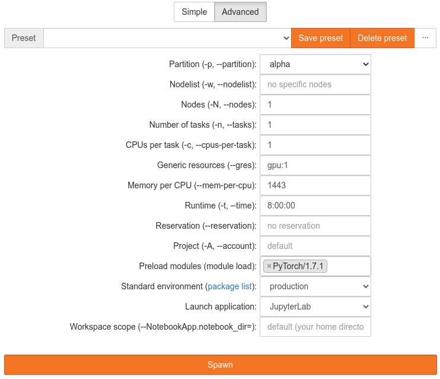

# PyTorch

[PyTorch](https://pytorch.org/) is an open-source machine learning framework.
It is an optimized tensor library for deep learning using GPUs and CPUs.
PyTorch is a machine learning tool developed by Facebook's AI division to process large-scale
object detection, segmentation, classification, etc.
PyTorch provides a core data structure, the tensor, a multi-dimensional array that shares many
similarities with NumPy arrays.

Please check the software modules list via

```console
marie@login$ module spider pytorch
```

to find out, which PyTorch modules are available.

We recommend using partitions `alpha` and/or `ml` when working with machine learning workflows
and the PyTorch library.
You can find detailed hardware specification in our
[hardware documentation](../jobs_and_resources/hardware_overview.md).

## PyTorch Console

On the partition `alpha`, load the module environment:

```console
# Job submission on alpha nodes with 1 gpu on 1 node with 800 Mb per CPU
marie@login$ srun -p alpha --gres=gpu:1 -n 1 -c 7 --pty --mem-per-cpu=800 bash
marie@alpha$ module load modenv/hiera  GCC/10.2.0  CUDA/11.1.1 OpenMPI/4.0.5 PyTorch/1.9.0
Die folgenden Module wurden in einer anderen Version erneut geladen:
  1) modenv/scs5 => modenv/hiera

Module GCC/10.2.0, CUDA/11.1.1, OpenMPI/4.0.5, PyTorch/1.9.0 and 54 dependencies loaded.
```

??? hint "Torchvision on partition `alpha`"

    On the partition `alpha`, the module torchvision is not yet available within the module
    system. (19.08.2021)
    Torchvision can be made available by using a virtual environment:

    ```console
    marie@alpha$ virtualenv --system-site-packages python-environments/torchvision_env
    marie@alpha$ source python-environments/torchvision_env/bin/activate
    marie@alpha$ pip install torchvision --no-deps
    ```

    Using the **--no-deps** option for "pip install" is necessary here as otherwise the PyTorch
    version might be replaced and you will run into trouble with the CUDA drivers.

On the partition `ml`:

```console
# Job submission in ml nodes with 1 gpu on 1 node with 800 Mb per CPU
marie@login$ srun -p ml --gres=gpu:1 -n 1 -c 7 --pty --mem-per-cpu=800 bash
```

After calling

```console
marie@login$ module spider pytorch
```

we know that we can load PyTorch (including torchvision) with

```console
marie@ml$ module load modenv/ml torchvision/0.7.0-fossCUDA-2019b-Python-3.7.4-PyTorch-1.6.0
Module torchvision/0.7.0-fossCUDA-2019b-Python-3.7.4-PyTorch-1.6.0 and 55 dependencies loaded.
```

Now, we check that we can access PyTorch:

```console
marie@{ml,alpha}$ python -c "import torch; print(torch.__version__)"
```

The following example shows how to create a python virtual environment and import PyTorch.

```console
# Create folder
marie@ml$ mkdir python-environments
# Check which python are you using
marie@ml$ which python
/sw/installed/Python/3.7.4-GCCcore-8.3.0/bin/python
# Create virtual environment "env" which inheriting with global site packages
marie@ml$ virtualenv --system-site-packages python-environments/env
[...]
# Activate virtual environment "env". Example output: (env) bash-4.2$
marie@ml$ source python-environments/env/bin/activate
marie@ml$ python -c "import torch; print(torch.__version__)"
```

## PyTorch in JupyterHub

In addition to using interactive and batch jobs, it is possible to work with PyTorch using
JupyterHub.  The production and test environments of JupyterHub contain Python kernels, that come
with a PyTorch support.


{: align="center"}

## Distributed PyTorch

For details on how to run PyTorch with multiple GPUs and/or multiple nodes, see
[distributed training](distributed_training.md).

## Migrate PyTorch-script from CPU to GPU

It is recommended to use GPUs when using large training data sets. While TensorFlow automatically
uses GPUs if they are available, in PyTorch you have to move your tensors manually.

First, you need to import `torch.CUDA`:

```python3
import torch.CUDA
```

Then you define a `device`-variable, which is set to 'CUDA' automatically when a GPU is available
with this code:

```python3
device = torch.device('CUDA' if torch.CUDA.is_available() else 'cpu')
```

You then have to move all of your tensors to the selected device. This looks like this:

```python3
x_train = torch.FloatTensor(x_train).to(device)
y_train = torch.FloatTensor(y_train).to(device)
```

Remember that this does not break backward compatibility when you port the script back to a computer
without GPU, because without GPU, `device` is set to 'cpu'.

### Caveats

#### Moving Data Back to the CPU-Memory

The CPU cannot directly access variables stored on the GPU. If you want to use the variables, e.g.,
in a `print` statement or when editing with NumPy or anything that is not PyTorch, you have to move
them back to the CPU-memory again. This then may look like this:

```python3
cpu_x_train = x_train.cpu()
print(cpu_x_train)
...
error_train = np.sqrt(metrics.mean_squared_error(y_train[:,1].cpu(), y_prediction_train[:,1]))
```

Remember that, without `.detach()` before the CPU, if you change `cpu_x_train`, `x_train` will also
be changed.  If you want to treat them independently, use

```python3
cpu_x_train = x_train.detach().cpu()
```

Now you can change `cpu_x_train` without `x_train` being affected.

#### Speed Improvements and Batch Size

When you have a lot of very small data points, the speed may actually decrease when you try to train
them on the GPU.  This is because moving data from the CPU-memory to the GPU-memory takes time. If
this occurs, please try using a very large batch size. This way, copying back and forth only takes
places a few times and the bottleneck may be reduced.
