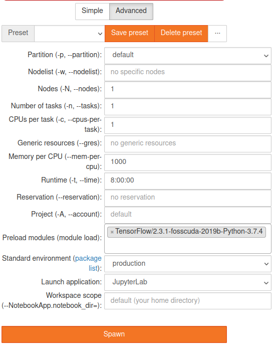

# TensorFlow

[TensorFlow](https://www.tensorflow.org) is a free end-to-end open-source software library for data
flow and differentiable programming across many tasks. It is a symbolic math library, used primarily
for machine learning applications. It has a comprehensive, flexible ecosystem of tools, libraries
and community resources.

Please check the software modules list via

```console
marie@compute$ module spider TensorFlow
[...]
```

to find out, which TensorFlow modules are available on your partition.

On ZIH systems, TensorFlow 2 is the default module version. For compatibility hints between
TensorFlow 2 and TensorFlow 1, see the corresponding [section below](#compatibility-tf2-and-tf1).

We recommend using partitions **Alpha** and/or **ML** when working with machine learning workflows
and the TensorFlow library. You can find detailed hardware specification in our
[Hardware](../jobs_and_resources/hardware_overview.md) documentation.

## TensorFlow Console

On the partition Alpha, load the module environment:

```console
marie@alpha$ module load modenv/scs5
```

Alternatively you can use `modenv/hiera` module environment, where the newest versions are
available

```console
marie@alpha$ module load modenv/hiera  GCC/10.2.0  CUDA/11.1.1  OpenMPI/4.0.5

The following have been reloaded with a version change:
  1) modenv/scs5 => modenv/hiera

Module GCC/10.2.0, CUDA/11.1.1, OpenMPI/4.0.5 and 15 dependencies loaded.
marie@alpha$ module avail TensorFlow

-------------- /sw/modules/hiera/all/MPI/GCC-CUDA/10.2.0-11.1.1/OpenMPI/4.0.5 -------------------
   Horovod/0.21.1-TensorFlow-2.4.1    TensorFlow/2.4.1

[...]
```

On the partition ML load the module environment:

```console
marie@ml$ module load modenv/ml
The following have been reloaded with a version change:  1) modenv/scs5 => modenv/ml
```

This example shows how to install and start working with TensorFlow using the modules system.

```console
marie@ml$ module load TensorFlow
Module TensorFlow/2.3.1-fosscuda-2019b-Python-3.7.4 and 47 dependencies loaded.
```

Now we can use TensorFlow. Nevertheless when working with Python in an interactive job, we recommend
to use a virtual environment. In the following example, we create a python virtual environment and
import TensorFlow:

!!! example

    ```console
    marie@ml$ ws_allocate -F scratch python_virtual_environment 1
    Info: creating workspace.
    /scratch/ws/1/python_virtual_environment
    [...]
    marie@ml$ which python    #check which python are you using
    /sw/installed/Python/3.7.2-GCCcore-8.2.0
    marie@ml$ virtualenv --system-site-packages /scratch/ws/1/python_virtual_environment/env
    [...]
    marie@ml$ source /scratch/ws/1/python_virtual_environment/env/bin/activate
    marie@ml$ python -c "import tensorflow as tf; print(tf.__version__)"
    [...]
    2.3.1
    ```

## TensorFlow in JupyterHub

In addition to interactive and batch jobs, it is possible to work with TensorFlow using
JupyterHub. The production and test environments of JupyterHub contain Python and R kernels, that
both come with TensorFlow support. However, you can specify the TensorFlow version when spawning
the notebook by pre-loading a specific TensorFlow module:


{: align="center"}

!!! hint

    You can also define your own Jupyter kernel for more specific tasks. Please read about Jupyter
    kernels and virtual environments in our
    [JupyterHub](../access/jupyterhub.md#creating-and-using-your-own-environment) documentation.

## TensorFlow in Containers

Another option to use TensorFlow are containers. In the HPC domain, the
[Singularity](https://singularity.hpcng.org/) container system is a widely used tool. In the
following example, we use the tensorflow-test in a Singularity container:

```console
marie@ml$ singularity shell --nv /scratch/singularity/powerai-1.5.3-all-ubuntu16.04-py3.img
Singularity>$ export PATH=/opt/anaconda3/bin:$PATH
Singularity>$ source activate /opt/anaconda3    #activate conda environment
(base) Singularity>$ . /opt/DL/tensorflow/bin/tensorflow-activate
(base) Singularity>$ tensorflow-test
Basic test of tensorflow - A Hello World!!!...
[...]
```

## TensorFlow with Python or R

For further information on TensorFlow in combination with Python see
[data analytics with Python](data_analytics_with_python.md), for R see
[data analytics with R](data_analytics_with_r.md).

## Distributed TensorFlow

For details on how to run TensorFlow with multiple GPUs and/or multiple nodes, see
[distributed training](distributed_training.md).

## Compatibility TF2 and TF1

TensorFlow 2.0 includes many API changes, such as reordering arguments, renaming symbols, and
changing default values for parameters. Thus in some cases, it makes code written for the TensorFlow
1.X not compatible with TensorFlow 2.X. However, If you are using the high-level APIs (`tf.keras`)
there may be little or no action you need to take to make your code fully
[TensorFlow 2.0](https://www.tensorflow.org/guide/migrate) compatible. It is still possible to
run 1.X code, unmodified (except for contrib), in TensorFlow 2.0:

```python
import tensorflow.compat.v1 as tf
tf.disable_v2_behavior()    #instead of "import tensorflow as tf"
```

To make the transition to TensorFlow 2.0 as seamless as possible, the TensorFlow team has created
the tf_upgrade_v2 utility to help transition legacy code to the new API.

## Keras

[Keras](https://keras.io) is a high-level neural network API, written in Python and capable
of running on top of TensorFlow. Please check the software modules list via

```console
marie@compute$ module spider Keras
[...]
```

to find out, which Keras modules are available on your partition. TensorFlow should be automatically
loaded as a dependency. After loading the module, you can use Keras as usual.
