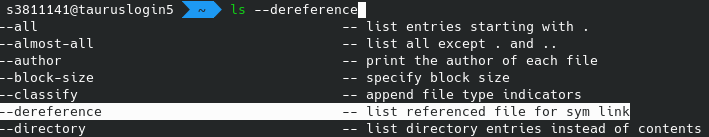

# ZSH

!!! warning
    Though all efforts have been made to ensure the accuracy and
    currency of the content on this website, please be advised that
    some content might be out of date and there is no continuous
    website support available. In case of any ambiguity or doubts,
    users are advised to do their own research on the content's
    accuracy and currency.

The [ZSH](https://www.zsh.org), short for `z-shell`, is an alternative shell for Linux that offers
many convenience features for productive use that `bash`, the default shell, does not offer.

This should be a short introduction to `zsh` and offer some examples that are especially useful
on ZIH systems.

## `oh-my-zsh`

`oh-my-zsh` is a plugin that adds many features to the `zsh` with a very simple install. Simply run:

```
marie@login$ sh -c "$(curl -fsSL https://raw.githubusercontent.com/ohmyzsh/ohmyzsh/master/tools/install.sh)"
```

and then, if it is not already your login shell, run `zsh` or re-login.

The rest of this document assumes that you have `oh-my-zsh` installed and running.

## Features

### Themes

There are many different themes for the `zsh`. See the
[GitHub-page of `oh-my-zsh`](https://github.com/ohmyzsh/ohmyzsh) for more details.

### Auto-completion

`zsh` offers more auto-completion features than `bash`. You can auto-complete programs, filenames, parameters,
`man`-pages and a lot more, and you can cycle through the suggestions with `TAB`-button.



### Syntax-highlighting

When you add this line to your `~/.zshrc` with `oh-my-zsh` installed, you get syntax-highlighting directly
in the shell:

```bash
plugins+=(
  zsh-syntax-highlighting
)
```


### Typo-correction

With

```bash
setopt correct_all
ENABLE_CORRECTION="true"
```

in `~/.zshrc` you get correction suggestions when the shell thinks
that it might be what you want, e.g. when a command
is expected to be handed an existing file.


### Automatic `cd`

Adding `AUTO_CD` to `~/.zshrc` file allows to leave out the `cd` when a folder name is provided.

```bash
setopt AUTO_CD
```


### `fish`-like auto-suggestions

Install [`zsh-autosuggestions`](https://github.com/zsh-users/zsh-autosuggestions) to get `fish`-shell-like
auto-suggestions of previous commands that start with the same letters and that you can complete with
the right arrow key.


??? example "Addons for your shell"
    === "`bash`"
        ```bash
        # Create a new directory and directly `cd` into it
        mcd () {
            mkdir -p $1
            cd $1
        }

        # Find the largest files in the current directory easily
        function treesizethis {
            du -k --max-depth=1 | sort -nr | awk '
             BEGIN {
            split("KB,MB,GB,TB", Units, ",");
             }
             {
            u = 1;
            while ($1 >= 1024) {
               $1 = $1 / 1024;
               u += 1
            }
            $1 = sprintf("%.1f %s", $1, Units[u]);
            print $0;
             }
            '
        }

        #This allows you to run `slurmlogpath $SLURM_ID` and get the log-path directly in stdout:
        function slurmlogpath {
            scontrol show job $1 | sed -n -e 's/^\s*StdOut=//p'
        }

        # `ftails` follow-tails a slurm-log. Call it without parameters to tail the only running job or
        # get a list of running jobs or use `ftails $JOBID` to tail a specific job
        function ftails {
            JOBID=$1
            if [[ -z $JOBID ]]; then
                 JOBS=$(squeue --format="%i \\'%j\\' " --me | grep -v JOBID)
                 NUMBER_OF_JOBS=$(echo "$JOBS" | wc -l)
                 JOBID=
                 if [[ "$NUMBER_OF_JOBS" -eq 1 ]]; then
                     JOBID=$(echo $JOBS | sed -e "s/'//g" | sed -e 's/ .*//')
                 else
                     JOBS=$(echo $JOBS | tr -d '\n')
                     JOBID=$(eval "whiptail --title 'Choose jobs to tail' --menu 'Choose Job to tail' 25 78 16 $JOBS" 3>&1 1>&2 2>&3)
                 fi
            fi
            SLURMLOGPATH=$(slurmlogpath $JOBID)
            if [[ -e $SLURMLOGPATH ]]; then
                tail -n100 -f $SLURMLOGPATH
            else
                echo "No slurm-log-file found"
            fi
        }

        #With this, you only need to type `sq` instead of `squeue -u $USER`.
        alias sq="squeue --me"
        ```
    === "`zsh`"
        ```bash
        # Create a new directory and directly `cd` into it
        mcd () {
            mkdir -p $1
            cd $1
        }

        # Find the largest files in the current directory easily
        function treesizethis {
            du -k --max-depth=1 | sort -nr | awk '
             BEGIN {
            split("KB,MB,GB,TB", Units, ",");
             }
             {
            u = 1;
            while ($1 >= 1024) {
               $1 = $1 / 1024;
               u += 1
            }
            $1 = sprintf("%.1f %s", $1, Units[u]);
            print $0;
             }
            '
        }

        #This allows you to run `slurmlogpath $SLURM_ID` and get the log-path directly in stdout:
        function slurmlogpath {
            scontrol show job $1 | sed -n -e 's/^\s*StdOut=//p'
        }

        # `ftails` follow-tails a slurm-log. Call it without parameters to tail the only running job or
        # get a list of running jobs or use `ftails $JOBID` to tail a specific job
        function ftails {
            JOBID=$1
            if [[ -z $JOBID ]]; then
                 JOBS=$(squeue --format="%i \\'%j\\' " --me | grep -v JOBID)
                 NUMBER_OF_JOBS=$(echo "$JOBS" | wc -l)
                 JOBID=
                 if [[ "$NUMBER_OF_JOBS" -eq 1 ]]; then
                     JOBID=$(echo $JOBS | sed -e "s/'//g" | sed -e 's/ .*//')
                 else
                     JOBS=$(echo $JOBS | tr -d '\n')
                     JOBID=$(eval "whiptail --title 'Choose jobs to tail' --menu 'Choose Job to tail' 25 78 16 $JOBS" 3>&1 1>&2 2>&3)
                 fi
            fi
            SLURMLOGPATH=$(slurmlogpath $JOBID)
            if [[ -e $SLURMLOGPATH ]]; then
                tail -n100 -f $SLURMLOGPATH
            else
                echo "No slurm-log-file found"
            fi
        }

        #With this, you only need to type `sq` instead of `squeue -u $USER`.
        alias sq="squeue --me"

        #This will automatically replace `...` with `../..` and `....` with `../../..`
        # and so on (each additional `.` adding another `/..`) when typing commands:
        rationalise-dot() {
            if [[ $LBUFFER = *.. ]]; then
                LBUFFER+=/..
            else
                LBUFFER+=.
            fi
        }
        zle -N rationalise-dot
        bindkey . rationalise-dot

        # This allows auto-completion for `module load`:
        function _module {
            MODULE_COMMANDS=(
                '-t:Show computer parsable output'
                'load:Load a module'
                'unload:Unload a module'
                'spider:Search for a module'
                'avail:Show available modules'
                'list:List loaded modules'
            )

            MODULE_COMMANDS_STR=$(printf "\n'%s'" "${MODULE_COMMANDS[@]}")

            eval "_describe 'command' \"($MODULE_COMMANDS_STR)\""
            _values -s ' ' 'flags' $(ml -t avail | sed -e 's#/$##' | tr '\n' ' ')
        }

        compdef _module "module"
        ```

## Setting `zsh` as default-shell

Please ask HPC support if you want to set the `zsh` as your default login shell.
